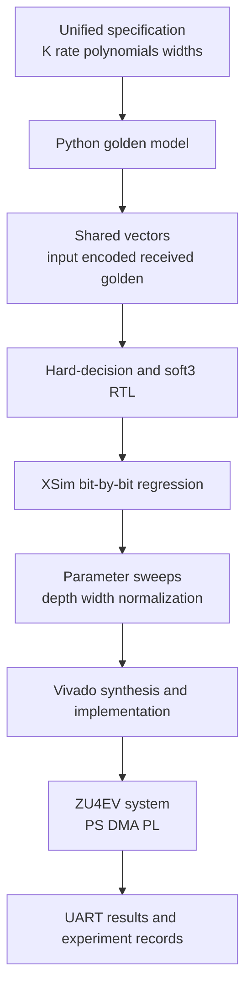
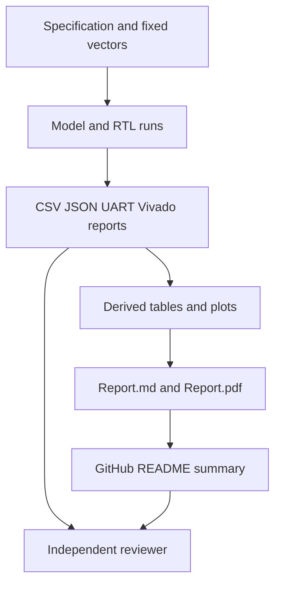

<div align="center">


Figure 1 Project hero banner

<h1>Resource-Aware Soft-Decision Viterbi Decoder</h1>

<p><strong>A complete evidence chain from a Python golden model and SystemVerilog RTL to Vivado implementation and ZU4EV board validation</strong></p>

<p>
  <a href="README.md">中文</a> ·
  <a href="#7-quick-reproduction">Quick start</a> ·
  <a href="#3-validation-results">Results</a> ·
  <a href="Report.md">Full report</a> ·
  <a href="Report.pdf">PDF report</a>
</p>

<p>
  
  
  
  
  
</p>

</div>

> [!IMPORTANT]
> The current version closes the functional loop across the algorithm, RTL, implementation, and physical board
> The soft-decision hero does not meet its 100 MHz timing constraint, so this is a reproducible functional-validation design rather than a timing-clean 100 MHz implementation

Every number in this document was checked on 2026-08-24 against `spec/viterbi_spec.json`, test logs, experiment CSVs, Vivado reports, and board-run records

## 1 Project overview

The formal code has rate $R=1/2$, constraint length $K=7$, and octal polynomials $(171)_8$ and $(133)_8$
The Viterbi algorithm keeps minimum-cost survivor paths through a trellis and recovers the most likely source-bit sequence under a maximum-likelihood criterion [1], [2]

The project retains a hard-decision baseline and a 3-bit soft-decision hero
Soft symbols use values from 0 through 7 to express received-symbol confidence, allowing the branch metric to retain information discarded by a hard decision

The work originated as an ECSE 6680 Advanced VLSI Design open-ended final project
Its central question is how to select decision mode, traceback depth, path-metric width, normalization, and Add-Compare-Select organization on MZU04A-4EV / XCZU4EV while balancing correction behavior, hardware cost, timing, and board-level verification

<div align="center">

Table 1.1. Project position

| Dimension | Current implementation | Evidence |
| --- | --- | --- |
| Formal code | rate-$1/2$, $K=7$, 64 states, $(171)_8$ and $(133)_8$ | `spec/viterbi_spec.json` |
| Decision modes | Hard-decision baseline and 3-bit soft-decision hero | `model/` and `rtl/viterbi_core/` |
| Target device | MZU04A-4EV, XCZU4EV-SFVC784-2I | `spec/viterbi_spec.json` |
| Validation layers | Python, XSim RTL, sweeps, Vivado, and JTAG/UART board | `EXPERIMENTS.yaml` |
| Hero configuration | soft3, traceback 40, 12-bit metric, subtract-min | `spec/viterbi_spec.json` |
| Current conclusion | Functional loop passed; soft-decision 100 MHz timing did not close | `data/impl/timing_analysis.md` |

</div>

<div align="center">


Figure 1.1. End-to-end engineering evidence chain

</div>

## 2 Design structure

A single specification freezes the coding and decoding parameters before the Python model produces trusted outputs
RTL, vectors, sweeps, and board software share those parameters, reducing drift caused by maintaining constants separately in each stage

<div align="center">



Figure 2.1. Design and validation data flow

</div>

<div align="center">

Table 2.1. Hero-design parameters

| Parameter | Value | Selection basis |
| --- | --- | --- |
| Code rate | 1/2 | Produces 2 encoded bits for each source bit |
| Constraint length | K=7 | Creates $2^{K-1}=64$ trellis states [3] |
| Polynomials | $(171)_8$ and $(133)_8$ | Formal convolutional-code configuration in the specification |
| Soft-symbol width | 3 bits | Values 0 through 7 express received reliability |
| Traceback depth | 40 | Zero mismatches in the current 864-bit sweep while costing less storage and wait time than depth 64 |
| Path-metric width | 12 bits | Zero mismatches in the fixed vectors with margin for later longer frames |
| Normalization | subtract-min | Preserves relative metrics while controlling numerical growth |
| Termination | zero-tail | Returns the encoder to the all-zero state at the end of a frame |

</div>

<div align="center">


Figure 2.2. Branch metric, ACS, survivor, and traceback flow

</div>

## 3 Validation results

The evidence retains successful and unsuccessful outcomes
This distinction separates functional correctness, tool completion, and timing closure instead of presenting a completed Vivado run as proof that the target frequency passed

<div align="center">

Table 3.1. Validation gates

| Layer | Scope | Result | Original record |
| --- | --- | --- | --- |
| Python model | K=3 smoke, K=7 formal, single-error correction, finite soft3 | 6 tests passed | `data/model/model_unit_test_summary.json` |
| Hard-decision RTL | no-noise, all-zero, impulse-one, single-bit-error | 4 cases with zero mismatches | `data/regression/rtl_regression_summary.csv` |
| Soft-decision RTL | AWGN at 0 dB, 1 dB, and 2 dB | 3 cases with zero mismatches | `data/regression/soft3_regression_summary.csv` |
| Parameter sweep | 4 depths × 4 widths × 2 normalizers × 9 vectors | 288 rows; short traceback exposed mismatches | `data/analysis/sweep_results.csv` |
| Vivado | Hard synthesis, soft synthesis, soft implementation | 3 tool runs completed; soft 100 MHz timing failed | `data/impl/vivado_summary.csv` |
| ZU4EV board | PS, DMA, PL, and UART chain | Final 3 cases passed with zero mismatches | `data/board_runs/board_summary.csv` |

</div>

### 3.1 Traceback depth

The depth sweep fixes the path metric at 12 bits with subtract-min normalization
Each depth covers 9 fixed vectors and 864 payload bits

<div align="center">


Figure 3.1. Effect of traceback depth on mismatches in the fixed vectors

</div>

<div align="center">

Table 3.2. Traceback-depth sweep

| Depth | Sample scope | Mismatches | Observed mismatch rate |
| ---: | ---: | ---: | ---: |
| 16 | 9 vectors, 864 bits | 8 | 0.009259 |
| 32 | 9 vectors, 864 bits | 0 | 0 |
| 40 | 9 vectors, 864 bits | 0 | 0 |
| 64 | 9 vectors, 864 bits | 0 | 0 |

</div>

These results describe only the fixed vector set
An 864-bit sample cannot replace a large Monte Carlo bit-error-rate curve, so this README reports an observed mismatch rate rather than generalizing it into a statistical BER claim

### 3.2 Path-metric width

At depth 40 with subtract-min enabled, 8-, 10-, 12-, and 16-bit metrics all produced zero mismatches across the current 9 vectors
That result does not establish that 8 bits are sufficient for longer frames, stronger noise, or disabled normalization
The hero uses 12 bits to retain numerical margin beyond the current passing vectors

<div align="center">


Figure 3.2. Path-metric width and register-scale relationship

</div>

## 4 Board loop

The final validation ran on a physical MZU04A-4EV
The processing system uses AXI DMA to send input into the Viterbi core in programmable logic, reads the output back, and compares it bit by bit with golden vectors
JTAG performs temporary download only, and the default policy prohibits non-volatile writes

<table>
  <tr>
    <td width="46%" align="center"></td>
    <td width="54%" align="center"></td>
  </tr>
  <tr>
    <td align="center"><em>Figure 4.1. Physical ZU4EV validation platform</em></td>
    <td align="center"><em>Figure 4.2. Final UART pass record</em></td>
  </tr>
</table>

<div align="center">

Table 4.1. Final board cases

| Case | Input samples | Decoded bits | Cycles | Mismatches | Result |
| --- | ---: | ---: | ---: | ---: | --- |
| no_noise | 204 | 96 | 802 | 0 | PASS |
| single_bit_error | 204 | 96 | 855 | 0 | PASS |
| soft_awgn_2db | 204 | 96 | 855 | 0 | PASS |

</div>

The final board shell ran at 25 MHz
From the whole-frame cycle record, no_noise took $802/25\text{ MHz}=32.08\text{ μs}$ and delivered $96/32.08\text{ μs}=2.99\text{ Mbit/s}$
The other 2 cases took $855/25\text{ MHz}=34.20\text{ μs}$ and delivered approximately 2.81 Mbit/s

These values include register control, DMA, core processing, readback, and verification overhead
They are not the decoder's ideal steady-state per-cycle throughput

## 5 Implementation results

Vivado reports use a 10 ns constraint, corresponding to the 100 MHz target [4]
The hard-decision baseline retains positive timing margin after synthesis
The soft3 hero completes synthesis, placement, and routing, but its worst slack remains negative

<div align="center">


Figure 5.1. Resources, 100 MHz timing slack, and tool-estimated power

</div>

<div align="center">

Table 5.1. Vivado results

| Design | Stage | LUT | FF | WNS | TNS | Tool-estimated power |
| --- | --- | ---: | ---: | ---: | ---: | ---: |
| Hard-decision core | Synthesis | 8,116 | 15,243 | +6.956 ns | 0 ns | 0.410 W |
| soft3 core | Synthesis | 10,570 | 17,118 | -23.241 ns | -17,607.301 ns | 0.469 W |
| soft3 core | Implementation | 10,647 | 17,118 | -20.433 ns | -16,272.939 ns | 0.487 W |

</div>

The routed critical path has 30.415 ns data delay, split into 13.839 ns logic and 16.576 ns routing across 116 logic levels
The main pressure comes from the single-cycle 64-state soft ACS update and subtract-min reduction

The 0.487 W value is a vectorless Vivado estimate under the 100 MHz analysis condition
It uses neither measured board switching activity nor a 25 MHz board power instrument

## 6 Environment

<div align="center">

Table 6.1. Tools and hardware

| Scope | Required | Purpose |
| --- | --- | --- |
| Base model | Python 3 and pytest | Golden model and unit tests |
| Data and plots | NumPy, pandas, and Matplotlib | Environment checks, sweeps, and report plots |
| Serial | pyserial | UART capture and serial smoke tests |
| FPGA tools | AMD Vivado 2024.1, Vitis 2024.1, and XSCT | RTL simulation, implementation, platform, and bare-metal app |
| Hardware | MZU04A-4EV, JTAG, and UART | Physical-board loop |
| Safety policy | `ALLOW_FLASH_WRITE=0` | Allows temporary download only by default |

</div>

`config/env.example` contains example paths and an example serial port only
The copied `config/local.env` contains local tool and board details and is excluded by `.gitignore`

## 7 Quick reproduction

### 7.1 Python model

Step one, create a virtual environment and install test dependencies

```bash
python -m venv .venv # Creates an environment isolated from the system Python
python -m pip install pytest matplotlib numpy pandas pyserial # Installs dependencies used by model, plot, and serial scripts
```

Step two, run the golden-model tests

```bash
python -m pytest tests -q # Runs the 6 K=3 and K=7 model checks
```

Step three, regenerate the fixed vectors

```bash
python scripts/gen_vectors.py --spec spec/viterbi_spec.json --out vectors # Builds inputs, received values, and golden outputs from the unified specification
```

### 7.2 RTL and parameter sweeps

Step one, copy the environment template and enter local Vivado, Vitis, and project paths

```bash
cp config/env.example config/local.env # Creates an untracked local tool configuration
python scripts/sanity_check_environment.py --env config/local.env # Checks paths, packages, commands, and the no-flash policy
```

Step two, run hard-decision and soft3 regressions

```bash
python scripts/run_rtl_regression.py --env config/local.env # Compares hard-decision XSim RTL with golden output
python scripts/run_soft3_regression.py --env config/local.env # Compares soft-decision XSim RTL with golden output
```

Step three, run the full sweep and collect Vivado reports

```bash
python scripts/run_sweeps.py --spec spec/viterbi_spec.json --vectors vectors --out data/analysis/sweep_results.csv # Generates all 288 parameter-combination rows
python scripts/run_vivado_reports.py --env config/local.env # Summarizes synthesis and implementation resources, timing, and power
```

### 7.3 Board validation

Board execution requires a generated bitstream, XSA, Vitis platform, and bare-metal ELF
`vitis/zu4ev_baremetal/README.md` documents the build and download sequence [5]

```bash
python scripts/run_board_validation.py --skip-build --build-info "<build_info.json>" --port "<serial-port>" --baud 115200 --capture-timeout 180 # Temporarily downloads to an authorized board and captures UART
```

Replace the build-information path and serial port with local values
The scripts do not authorize flash programming by default

## 8 Repository map

<div align="center">

Table 8.1. Directory structure

| Path | Content |
| --- | --- |
| `spec/` | Single source of truth for design parameters |
| `model/` | Encoder, channel, trellis, and golden decoder |
| `vectors/` | Fixed input, encoded, received, and golden outputs |
| `rtl/common/` | Shared SystemVerilog package |
| `rtl/viterbi_core/` | BMU, ACS, metrics, survivor storage, and traceback |
| `rtl/system/` | AXI Stream wrapper, control registers, and ZU4EV shell |
| `tb/` | Hard-decision and soft3 XSim testbenches |
| `vivado/` | Synthesis, implementation, and ZU4EV Tcl flows |
| `vitis/zu4ev_baremetal/` | ARM bare-metal validation application |
| `scripts/` | Environment, generation, regression, sweep, implementation, and board automation |
| `data/` | Model, regression, sweep, Vivado, and board evidence |
| `docs/assets/` | Report plots, diagrams, and board imagery |
| `EXPERIMENTS.yaml` | Command, result, and evidence index for every phase |
| `DECISIONS.md` | Architecture decisions and tradeoffs |
| `WORKLOG.md` | Phase-by-phase execution record |

</div>

## 9 Evidence traceability

`EXPERIMENTS.yaml` connects commands, parameters, results, and evidence files with run identifiers
Key `Report.md` claims point back to CSV, JSON, Vivado reports, and UART logs, allowing independent review

<div align="center">



Figure 9.1. Traceability from claims to original evidence

</div>

Earlier board failures remain in the repository
Only the final run passed among 4 board attempts; the previous 3 record serial timeouts or a functional failure
Those negative results show that the final PASS followed system debugging rather than selective reporting

## 10 Reports

- [Report.md](Report.md) covers algorithm background, specification, RTL, verification, timing, throughput, power, board system, bottlenecks, and references
- [Report.pdf](Report.pdf) is a fixed-layout 40-page report whose current file removes personal identity fields and authoring-tool metadata
- `scripts/build_final_report.py` regenerates derived CSVs and report plots but intentionally does not rewrite `Report.md` or `Report.pdf`

> [!NOTE]
> The PDF is a public deliverable
> A report-text change requires a synchronized PDF plus full-text, metadata, and rendered-page checks

## 11 Known boundaries

- The soft3 hero does not close timing at 100 MHz; routed WNS is -20.433 ns
- The board PASS uses a 25 MHz shell and cannot be generalized into a 100 MHz board result
- Observed mismatch rates come from fixed short frames and do not replace a statistical long-frame BER curve
- Board cycle counts describe whole-frame completion and not first-valid latency
- Power is a vectorless Vivado estimate and not a measured board value
- Automated tests cover the Python model; Vivado, XSim, and physical-board checks require local tools and hardware
- The repository has no GitHub Actions workflow, so a remote commit does not rerun the FPGA toolchain

Future high-frequency work should pipeline ACS and subtract-min reduction, then combine retiming with a hierarchical minimum tree or grouped state updates
Long-frame performance work needs more random frames, more SNR points, and reproducible confidence intervals

## 12 Privacy

- Public configuration uses examples such as `/path/to/...`, `<serial-port>`, and `<your-github-owner>`
- Board records use repository-relative paths or the `%VITERBI_STAGE%` placeholder
- The README, report, PDF metadata, and images contain no personal name, user directory, account, password, token, or private server address
- New UART, Vivado, Vitis, or XSCT logs must remove local paths, device serial numbers, accounts, and license details before publication

## 13 Contribution

Step one, update `spec/viterbi_spec.json` or explain why a change affects implementation only

Step two, run Python tests, relevant RTL regressions, and the parameter sweep

Step three, record each experiment's command, input, result, and evidence path in `EXPERIMENTS.yaml`

Step four, recapture Vivado timing and resources when the hardware structure changes

Step five, use temporary JTAG download for board changes and retain the original UART record

Step six, synchronize both READMEs, the Markdown report, and the PDF public deliverable

A contribution must not use “implemented successfully” in place of evidence
Functional, timing, and board outcomes must be reported separately

## 14 License

The repository currently has no `LICENSE` file and declares no open-source license
Until the rights holder adds one, default copyright rules apply and public visibility does not grant permission to copy, modify, or redistribute the work

## 15 References

[1] A. J. Viterbi, “Error bounds for convolutional codes and an asymptotically optimum decoding algorithm,” `IEEE Transactions on Information Theory`, vol. 13, no. 2, pp. 260-269, Apr. 1967, doi: [10.1109/TIT.1967.1054010](https://doi.org/10.1109/TIT.1967.1054010)

[2] G. D. Forney, Jr., “The Viterbi algorithm,” `Proceedings of the IEEE`, vol. 61, no. 3, pp. 268-278, Mar. 1973, doi: [10.1109/PROC.1973.9030](https://doi.org/10.1109/PROC.1973.9030)

[3] S. Lin and D. J. Costello, `Error Control Coding`, 2nd ed. Upper Saddle River, NJ, USA: Prentice Hall, 2004

[4] AMD, “Vivado Design Suite User Guide: Design Analysis and Closure Techniques, UG906.” [Online]. Available: https://docs.amd.com/r/2022.2-English/ug906-vivado-design-analysis

[5] AMD, “Zynq UltraScale+ Device Technical Reference Manual, UG1085.” [Online]. Available: https://docs.amd.com/v/u/en-US/ug1085-zynq-ultrascale-trm
