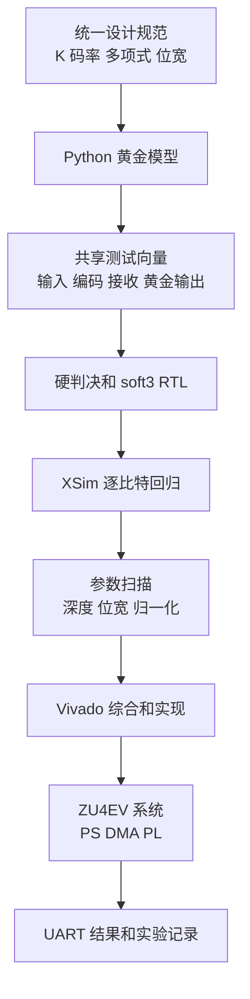
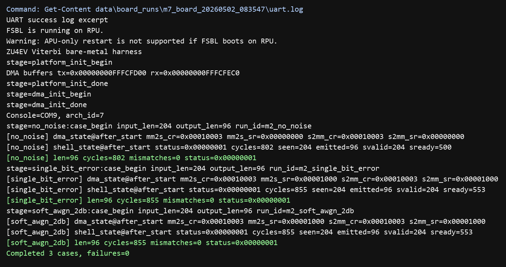
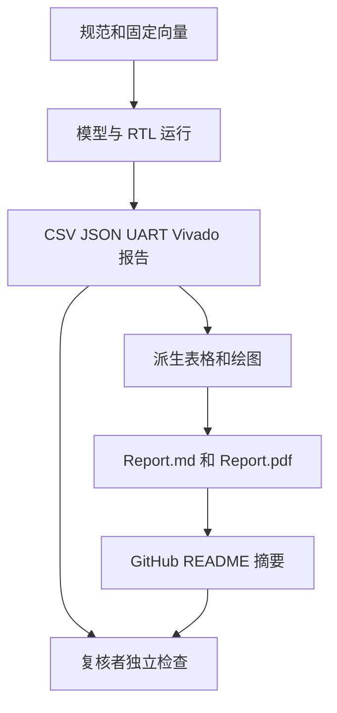

<div align="center">


图 1 项目入口横幅

<h1>资源感知软判决 Viterbi 解码器</h1>

<p><strong>从 Python 黄金模型、SystemVerilog RTL、Vivado 实现到 ZU4EV 板卡验证的完整证据链</strong></p>

<p>
  <a href="README.en.md">English</a> ·
  <a href="#7-快速复现">快速复现</a> ·
  <a href="#3-验证结果">验证结果</a> ·
  <a href="Report.md">完整报告</a> ·
  <a href="Report.pdf">PDF 报告</a>
</p>

<p>
  
  
  
  
  
</p>

</div>

> [!IMPORTANT]
> 当前版本已经完成算法、RTL、实现和真实板卡的功能闭环
> 软判决主设计尚未满足 100 MHz 时序约束，因此它是可复现的功能验证版本，不是 100 MHz 时序收敛版本

本文中的数值来自 2026-08-24 对 `spec/viterbi_spec.json`、测试日志、实验 CSV、Vivado 报告和板卡运行记录的核对结果

## 1 项目概览

设计规范记录正式卷积码的码率为 $R=1/2$
约束长度取 $K=7$
两组八进制多项式分别取 $(171)_8$ 和 $(133)_8$
Viterbi 算法会在网格图中保留累计代价最小的幸存路径，用最大似然准则恢复最可能的原始比特序列 [1], [2]

项目同时保留硬判决基线和 3 位软判决主设计
软判决输入用 0 到 7 表达接收符号的可信程度，因此分支度量能够利用硬判决丢弃的可靠性信息

本项目源自 ECSE 6680 Advanced VLSI Design 开放式期末项目
研究对象是 MZU04A-4EV 和 XCZU4EV 平台上的解码器实现
核心问题是如何选择判决模式、回溯深度、路径度量位宽、归一化方法和加比选结构，并平衡纠错能力、硬件成本、时序和板卡可验证性

<div align="center">

表 1.1　项目定位

| 维度 | 当前实现 | 证据 |
| --- | --- | --- |
| 正式编码 | rate-$1/2$，$K=7$，64 状态，$(171)_8$ 和 $(133)_8$ | `spec/viterbi_spec.json` |
| 判决模式 | 硬判决基线和 3 位软判决主设计 | `model/`、`rtl/viterbi_core/` |
| 目标器件 | MZU04A-4EV，XCZU4EV-SFVC784-2I | `spec/viterbi_spec.json` |
| 验证层级 | Python、XSim RTL、参数扫描、Vivado、JTAG/UART 板卡 | `EXPERIMENTS.yaml` |
| 正式主配置 | soft3，回溯深度 40，路径度量 12 位，subtract-min | `spec/viterbi_spec.json` |
| 当前结论 | 功能闭环通过，100 MHz 软判决实现时序未收敛 | `data/impl/timing_analysis.md` |

</div>

<div align="center">


图 1.1　端到端工程证据链

</div>

## 2 设计结构

设计先用单一规范文件冻结编码和解码参数，再由 Python 模型生成可信结果
RTL、测试向量、参数扫描和板卡程序共同引用这组参数，减少不同阶段各自维护常量造成的偏差

<div align="center">



图 2.1　设计和验证数据流

</div>

<div align="center">

表 2.1　主设计参数

| 参数 | 取值 | 选择依据 |
| --- | --- | --- |
| 码率 | 1/2 | 每个原始输入比特生成 2 个编码比特 |
| 约束长度 | K=7 | 形成 $2^{K-1}=64$ 个网格状态 [3] |
| 多项式 | $(171)_8$ 和 $(133)_8$ | 规范文件中的正式卷积码配置 |
| 软符号位宽 | 3 位 | 以 0 到 7 表达接收可靠性 |
| 回溯深度 | 40 | 当前 864 比特扫描样本中 0 个不匹配，同时低于深度 64 的存储和等待成本 |
| 路径度量位宽 | 12 位 | 当前固定向量中 0 个不匹配，并为后续更长帧保留余量 |
| 归一化 | subtract-min | 每一步减去最小路径度量，保留相对大小并抑制数值增长 |
| 终止方式 | zero-tail | 帧尾补零，使编码状态返回全零状态 |

</div>

<div align="center">


图 2.2　分支度量、加比选、幸存路径和回溯流程

</div>

## 3 验证结果

验证结果同时保留成功结果和失败结果
这种记录方式能够区分功能正确、工具完成和时序收敛，避免把 Vivado 成功生成实现结果误写成目标频率已经通过

<div align="center">

表 3.1　验证门禁

| 层级 | 检查范围 | 结果 | 原始记录 |
| --- | --- | --- | --- |
| Python 模型 | K=3 冒烟、K=7 正式配置、单错纠正、soft3 有限位宽 | 6 项测试通过 | `data/model/model_unit_test_summary.json` |
| 硬判决 RTL | no-noise、all-zero、impulse-one、single-bit-error | 4 个用例均为 0 个不匹配 | `data/regression/rtl_regression_summary.csv` |
| 软判决 RTL | AWGN 0 dB、1 dB、2 dB | 3 个用例均为 0 个不匹配 | `data/regression/soft3_regression_summary.csv` |
| 参数扫描 | 4 个深度 × 4 个位宽 × 2 种归一化 × 9 组向量 | 288 行结果，短回溯暴露不匹配 | `data/analysis/sweep_results.csv` |
| Vivado | 硬判决综合、软判决综合、软判决实现 | 3 次工具运行完成，软判决 100 MHz 时序失败 | `data/impl/vivado_summary.csv` |
| ZU4EV 板卡 | PS、DMA、PL、UART 全链路 | 最终 3 个用例通过，0 个不匹配 | `data/board_runs/board_summary.csv` |

</div>

### 3.1 回溯深度

扫描固定路径度量位宽 12 位和 subtract-min 归一化
每个深度覆盖 9 组固定向量，每组有效载荷为 96 bit
统计范围按照 $9 \times 96 = 864$ bit 计算

<div align="center">


图 3.1　回溯深度对当前固定向量不匹配数量的影响

</div>

<div align="center">

表 3.2　回溯深度扫描

| 深度 | 样本范围 | 不匹配数 | 观察到的不匹配率 |
| ---: | ---: | ---: | ---: |
| 16 | 9 组，864 bit | 8 | 0.009259 |
| 32 | 9 组，864 bit | 0 | 0 |
| 40 | 9 组，864 bit | 0 | 0 |
| 64 | 9 组，864 bit | 0 | 0 |

</div>

这些结果只说明固定向量集的行为
864 bit 样本不能替代大规模蒙特卡洛比特错误率曲线，README 使用“观察到的不匹配率”而不是把结果扩展为通用 BER 结论

### 3.2 路径度量位宽

深度固定为 40 且启用 subtract-min 时，8、10、12 和 16 位配置在当前 9 组向量中均为 0 个不匹配
该结果没有证明 8 位适用于更长帧、更强噪声或关闭归一化的场景
主设计选择 12 位，是为了在当前正确性和未来数值余量之间保留空间

<div align="center">


图 3.2　路径度量位宽和寄存器规模关系

</div>

## 4 板卡闭环

最终板卡验证在真实 MZU04A-4EV 上运行
处理系统通过 AXI DMA 把输入送到可编程逻辑中的 Viterbi 核心，再把输出取回并与黄金向量逐比特比较
JTAG 只做临时下载，默认策略禁止写入非易失存储器

<table>
  <tr>
    <td width="46%" align="center"></td>
    <td width="54%" align="center"></td>
  </tr>
  <tr>
    <td align="center"><em>图 4.1　真实 ZU4EV 验证平台</em></td>
    <td align="center"><em>图 4.2　最终 UART 通过记录</em></td>
  </tr>
</table>

<div align="center">

表 4.1　最终板卡用例

| 用例 | 输入样本 | 解码比特 | 周期 | 不匹配 | 结果 |
| --- | ---: | ---: | ---: | ---: | --- |
| no_noise | 204 | 96 | 802 | 0 | PASS |
| single_bit_error | 204 | 96 | 855 | 0 | PASS |
| soft_awgn_2db | 204 | 96 | 855 | 0 | PASS |

</div>

最终板卡外壳使用 25 MHz 时钟
按完整帧周期记录计算，no_noise 的帧时间为 $802/25\text{ MHz}=32.08\text{ μs}$，吞吐量为 $96/32.08\text{ μs}=2.99\text{ Mbit/s}$
另外 2 个用例的完整帧时间为 $855/25\text{ MHz}=34.20\text{ μs}$，吞吐量约为 2.81 Mbit/s

这些数值包含寄存器控制、DMA、核心处理、结果回读和验证开销
它们不等同于解码器稳定流水阶段的每周期吞吐量

## 5 实现结果

Vivado 报告使用 10 ns 时钟约束，对应 100 MHz 目标 [4]
硬判决基线在综合后保持正时序裕量
soft3 主设计可以完成综合、布局和布线，但最差负裕量仍为负值

<div align="center">


图 5.1　资源使用、100 MHz 时序裕量和工具功耗估计

</div>

<div align="center">

表 5.1　Vivado 结果

| 设计 | 阶段 | LUT | FF | WNS | TNS | 工具估计功耗 |
| --- | --- | ---: | ---: | ---: | ---: | ---: |
| 硬判决核心 | 综合 | 8,116 | 15,243 | +6.956 ns | 0 ns | 0.410 W |
| soft3 核心 | 综合 | 10,570 | 17,118 | -23.241 ns | -17,607.301 ns | 0.469 W |
| soft3 核心 | 实现 | 10,647 | 17,118 | -20.433 ns | -16,272.939 ns | 0.487 W |

</div>

路由后关键路径的数据延迟为 30.415 ns，其中逻辑延迟 13.839 ns、布线延迟 16.576 ns，共 116 级逻辑
关键压力来自单周期 64 状态 soft ACS 更新和 subtract-min 归约

0.487 W 是 Vivado 在 100 MHz 条件下给出的无向量功耗估计
它没有使用真实板卡开关活动，也不是 25 MHz 板卡实测功耗

## 6 环境要求

<div align="center">

表 6.1　工具和硬件

| 范围 | 需要 | 用途 |
| --- | --- | --- |
| 基础模型 | Python 3、pytest | 黄金模型和单元测试 |
| 数据和绘图 | NumPy、pandas、Matplotlib | 环境检查、参数分析和报告图 |
| 串口 | pyserial | UART 捕获和串口冒烟测试 |
| FPGA 工具 | AMD Vivado 2024.1、Vitis 2024.1、XSCT | RTL 仿真、实现、平台和裸机应用 |
| 硬件 | MZU04A-4EV、JTAG、UART | 真实板卡闭环 |
| 安全策略 | `ALLOW_FLASH_WRITE=0` | 默认只做临时下载，不写板载 Flash |

</div>

`config/env.example` 只包含示例路径和示例串口
复制后的 `config/local.env` 会包含本机工具和板卡信息，`.gitignore` 已将它排除

## 7 快速复现

### 7.1 Python 模型

- 第一步，创建本地虚拟环境并安装测试依赖

```bash
python -m venv .venv # 创建与系统 Python 隔离的环境
python -m pip install pytest matplotlib numpy pandas pyserial # 安装模型、绘图和串口脚本使用的依赖
```

- 第二步，运行黄金模型测试

```bash
python -m pytest tests -q # 执行 K=3 和 K=7 的 6 项模型验证
```

- 第三步，重新生成固定测试向量

```bash
python scripts/gen_vectors.py --spec spec/viterbi_spec.json --out vectors # 从统一规范生成输入、接收值和黄金输出
```

### 7.2 RTL 参数扫描

- 第一步，复制环境模板并填写本机 Vivado、Vitis 和项目路径

```bash
cp config/env.example config/local.env # 生成不会提交到 Git 的本机工具配置
python scripts/sanity_check_environment.py --env config/local.env # 验证路径、Python 包、命令和禁止写 Flash 策略
```

- 第二步，运行硬判决和 soft3 回归

```bash
python scripts/run_rtl_regression.py --env config/local.env # 使用 XSim 比较硬判决 RTL 和黄金输出
python scripts/run_soft3_regression.py --env config/local.env # 使用 XSim 比较软判决 RTL 和黄金输出
```

- 第三步，运行完整参数扫描和 Vivado 报告采集

```bash
python scripts/run_sweeps.py --spec spec/viterbi_spec.json --vectors vectors --out data/analysis/sweep_results.csv # 生成 288 行参数组合结果
python scripts/run_vivado_reports.py --env config/local.env # 运行综合和实现并汇总资源、时序和功耗
```

### 7.3 板卡验证

板卡操作需要已生成的 bitstream、XSA、Vitis 平台和裸机 ELF
`vitis/zu4ev_baremetal/README.md` 给出构建和下载顺序 [5]

```bash
python scripts/run_board_validation.py --skip-build --build-info "<build_info.json>" --port "<serial-port>" --baud 115200 --capture-timeout 180 # 只在已授权板卡上临时下载并采集 UART
```

命令中的构建信息路径和串口必须替换为本机值
脚本默认不授权写入 Flash

## 8 仓库导航

<div align="center">

表 8.1　目录结构

| 路径 | 内容 |
| --- | --- |
| `spec/` | 设计参数唯一事实源 |
| `model/` | 卷积编码、信道、网格图和黄金解码器 |
| `vectors/` | 固定输入、编码、接收和黄金输出 |
| `rtl/common/` | 共享 SystemVerilog 包 |
| `rtl/viterbi_core/` | BMU、ACS、路径度量、幸存存储和回溯核心 |
| `rtl/system/` | AXI Stream 包装、控制寄存器和 ZU4EV 外壳 |
| `tb/` | 硬判决和 soft3 XSim 测试平台 |
| `vivado/` | 综合、实现和 ZU4EV 系统 Tcl 脚本 |
| `vitis/zu4ev_baremetal/` | ARM 裸机板卡验证程序 |
| `scripts/` | 环境检查、生成、回归、扫描、实现和板卡自动化 |
| `data/` | 模型、回归、扫描、Vivado 和板卡原始证据 |
| `docs/assets/` | 报告图、流程图和板卡图片 |
| `EXPERIMENTS.yaml` | 每个阶段的命令、结果和证据索引 |
| `DECISIONS.md` | 架构决策和取舍 |
| `WORKLOG.md` | 按阶段记录的执行过程 |

</div>

## 9 证据追踪

`EXPERIMENTS.yaml` 使用运行标识把命令、参数、结果和数据文件连接起来
`Report.md` 的关键结论指向 CSV、JSON、Vivado 报告和 UART 日志，因此读者可以回到原始记录复核

<div align="center">



图 9.1　结论到原始证据的追踪关系

</div>

早期板卡失败记录仍然保留
4 次板卡运行中只有最终运行通过，前 3 次分别记录串口超时或功能失败
这些负面结果说明最终 PASS 来自系统问题定位和修复，不是只保留成功截图

## 10 报告

- [Report.md](Report.md) 包含算法背景、设计规范、RTL、验证、时序、吞吐量、功耗、板卡系统、瓶颈和参考文献
- [Report.pdf](Report.pdf) 是 40 页固定版式报告，当前文件已经移除个人身份字段和创作工具元数据
- `scripts/build_final_report.py` 重新生成派生 CSV 和报告图，但脚本明确不会自动重写 `Report.md` 或 `Report.pdf`

> [!NOTE]
> 当前 PDF 是公开交付物
> 修改报告正文后，需要同步更新 PDF 并重新进行全文、元数据和页面渲染检查

## 11 已知边界

- soft3 主设计没有完成 100 MHz 时序收敛，路由后 WNS 为 -20.433 ns
- 板卡 PASS 使用 25 MHz 外壳，不能扩展为 100 MHz 板卡通过结论
- 当前观察到的不匹配率来自固定短帧，不能替代统计意义上的长帧 BER 曲线
- 当前板卡周期是完整帧周期，不能解释为第一有效输出延迟
- 当前功耗是 Vivado 无向量估计，不是板卡仪器实测值
- 当前自动测试覆盖 Python 模型，Vivado、XSim 和真实板卡仍依赖本地工具与硬件
- 仓库没有 GitHub Actions 工作流，远程提交不会自动重跑 FPGA 工具链

后续高频实现需要在 ACS 和 subtract-min 归约之间增加流水级，配合重定时、分层最小值树或分组状态更新
长帧性能评估还需要更多随机帧、更多 SNR 点和可复算的统计区间

## 12 隐私约束

- 公开配置只使用 `/path/to/...`、`<serial-port>` 和 `<your-github-owner>` 等示例值
- 板卡记录使用仓库相对路径或 `%VITERBI_STAGE%` 占位目录
- README、报告、PDF 元数据和截图不包含个人姓名、用户目录、账号、密码、令牌或私有服务器地址
- 分享新的 UART、Vivado、Vitis 或 XSCT 日志前，需要删除本机路径、设备序列号、账号和许可证信息

## 13 贡献指南

- 第一步，修改 `spec/viterbi_spec.json` 或明确说明为什么只改实现

- 第二步，运行 Python 测试、相关 RTL 回归和参数扫描

- 第三步，把每次实验的命令、输入、结果和证据路径写入 `EXPERIMENTS.yaml`

- 第四步，若修改硬件结构，重新采集 Vivado 时序和资源结果

- 第五步，若修改板卡路径，使用 JTAG 临时下载并保留 UART 原始记录

- 第六步，同步更新双语 README、Markdown 报告和 PDF 公开交付物

提交不得用“实现成功”代替具体证据
功能、时序和板卡结果需要分别陈述

## 14 许可证

仓库当前没有 `LICENSE` 文件，也没有声明开源许可证
在权利人补充许可证之前，默认著作权规则适用，外部使用者不能把公开可见等同于获得复制、修改或再分发授权

## 15 参考资料

[1] A. J. Viterbi, “Error bounds for convolutional codes and an asymptotically optimum decoding algorithm,” `IEEE Transactions on Information Theory`, vol. 13, no. 2, pp. 260-269, Apr. 1967, doi: [10.1109/TIT.1967.1054010](https://doi.org/10.1109/TIT.1967.1054010)

[2] G. D. Forney, Jr., “The Viterbi algorithm,” `Proceedings of the IEEE`, vol. 61, no. 3, pp. 268-278, Mar. 1973, doi: [10.1109/PROC.1973.9030](https://doi.org/10.1109/PROC.1973.9030)

[3] S. Lin and D. J. Costello, `Error Control Coding`, 2nd ed. Upper Saddle River, NJ, USA: Prentice Hall, 2004

[4] AMD, “Vivado Design Suite User Guide: Design Analysis and Closure Techniques, UG906.” [Online]. Available: https://docs.amd.com/r/2022.2-English/ug906-vivado-design-analysis

[5] AMD, “Zynq UltraScale+ Device Technical Reference Manual, UG1085.” [Online]. Available: https://docs.amd.com/v/u/en-US/ug1085-zynq-ultrascale-trm
