# 软判决维特比译码器设计与验证

## 0. 摘要

Viterbi Decoder 是一种用于卷积码的最大似然译码算法，就是用来在所有可能的编码序列中，选择最有可能产生当前接收信号的那一条作为译码结果。卷积码在发送数据时会把当前输入 bit 和前面若干个历史 bit 一起参与编码，因此接收端看到的不是孤立的 bit，而是一串带有“历史记忆”的编码结果。

Viterbi Decoder 的作用，就是在所有可能的历史路径中，找出最可能产生当前接收序列的那一条路径。它通常把所有候选路径展开成 trellis（网格图），就是把卷积码所有可能的状态转移按时间展开成的图结构，用于系统地表示所有候选路径；然后每一步根据接收数据计算 branch metric（分支度量），就是衡量某一步状态转移与接收数据之间匹配程度的局部代价，再把这些局部代价累加成 path metric（路径度量），就是从起点到当前状态累计的总代价，用来评估整条路径的优劣，最后通过 ACS（Add-Compare-Select，加比选），就是对候选路径进行累加度量、比较大小、保留最优的核心操作，不断保留每个状态下最优的候选路径，并用 traceback（回溯），也就是从最终最优状态沿着记录的路径反向追踪，恢复原始输入比特序列。

本项目实现了一个面向 ZU4EV 开发板验证的软判决 Viterbi Decoder，软判决即是说译码时不仅使用 0/1 判决结果，还利用接收信号的置信度如多比特量化值，接收端看到的是带噪声的连续值，软判决用多个 bit 表示接收信号的可靠程度，而不是只硬性归并表示为 0 或 1，使Viterbi译码在有噪声环境下能更准确地区分候选路径，从而显著降低误码率

在输入形式上，本项目支持 hard-decision 和 soft-decision 两类译码输入。Hard-decision 只把接收结果表示为 0 或 1，译码器只能根据 bit 是否相同来计算距离。Soft-decision 保留更多接收置信度信息，例如本项目的 3-bit soft symbol 用 0 到 7 表示一个 bit 更像 0 还是更像 1，因此译码器可以利用“有多确定”来做更细的路径选择。

在理想情况下，如果没有噪声，译码问题是相对简单的，Viterbi Decoder 很容易恢复出原始数据，这种测试只能验证功能是否基本正确，但并不能反映算法在真实通信环境下的表现。而实际通信系统中，信号在传输过程中一定会受到各种随机干扰，例如热噪声、电路噪声等，这些噪声通常可以用高斯分布来很好地近似，因此 AWGN 成为最经典、最常用的信道模型

在本项目中引入 AWGN（Additive White Gaussian Noise，加性白高斯噪声），一种将服从高斯分布的随机噪声叠加到信号上的经典信道模型，目的是人为地在发送信号上叠加可控强度的随机噪声，从而构造更接近真实场景的输入数据。这样一来，接收端得到的不再是理想的 0/1，而是带有不确定性的连续值，这正是 soft-decision 发挥作用的前提。通过这种方式，可以验证译码器在有噪声条件下是否仍然能够正确选择路径、纠正错误，并评估其抗噪声能力；此外，使用 AWGN 还可以系统地调节信噪比（SNR），在不同噪声强度下观察译码性能变化，例如误码率的提升或下降

设计目标是完成一个从算法模型到真实板级运行的完整硬件闭环，先用 Python model 建立可对照的 golden reference，再生成统一的 test vectors，随后实现 RTL 译码核心，并通过 Vivado 完成综合、实现和资源时序分析，最后将设计部署到 ZU4EV 开发板上进行 board validation

整个流程关注三个核心问题
* 译码结果是否正确
* 硬件资源是否可接受
* 设计在目标平台上的时序和板级接口是否能够跑通

功能验证已经闭环通过。Python model 的 6 个单元测试全部通过，分别是
* K=3 无噪声 smoke test，K 表示 convolutional code 的 constraint length，也就是编码器在产生输出时会参考多少个输入 bit。K=3 表示编码器参考当前 bit 和前 2 个历史 bit，因此 trellis 只有 2^(K-1)=4 个状态，每个状态都是Viterbi Decoder对某种历史的一种猜测。这个测试用较小的 4-state trellis 先检查基本编码和译码流程，方便在进入正式参数前确认状态转移和路径选择逻辑没有问题
* K=3 soft3 无噪声 smoke test，在 K=3 的小规模配置下加入 soft3 输入。soft3 指 3-bit soft-decision symbol，也就是用 0 到 7 的数值表示接收符号更接近 0 还是更接近 1。这个测试用于确认软判决 branch metric 的计算方式正确，并且在没有噪声时能够恢复原始输入
* K=7 正式无噪声测试，K=7 是本项目正式使用的 constraint length，表示编码器参考当前 bit 和前 6 个历史 bit，因此 trellis 有 2^(K-1)=64 个状态。这个测试在正式 64-state 配置下、不加入信道噪声，验证 Viterbi Decoder 的基本译码结果是否与 golden output 完全一致
* K=7 tail termination 回到 zero state 测试，tail termination 指在 payload 末尾补入若干个 0，让编码器内部 shift register 回到全 0 状态。这样做可以让译码器知道 trellis 的结束状态，减少结尾路径不确定性。这个测试检查帧尾补零后，编码器和译码器是否都能正确处理 zero state 终止条件
* K=7 单个 encoded bit 错误纠正测试，这个测试在 K=7 正式配置下，人为把编码后的某一个 bit 翻转，模拟传输过程中出现的单个错误。测试目标是确认 Viterbi Decoder 能否利用卷积码的冗余信息，在存在一个 encoded bit 错误时仍然恢复正确的原始 payload
* K=7 soft3 有限位宽加 subtract-min normalization 测试，这个测试使用 K=7 正式配置、3-bit soft-decision 输入、有限 path metric 位宽，以及 subtract-min normalization。有限位宽表示硬件中的 path metric 不能无限增长，只能用固定 bit 数保存；subtract-min normalization 会在每一步把所有 path metric 同时减去当前最小值，保留相对大小关系，同时避免数值溢出。这个测试用于确认这些硬件实现约束加入后，译码结果仍然正确

限制也需要明确说明。在 Vivado 综合与实现阶段，soft-decision hero design 以 100 MHz 为目标频率进行布局布线，但没有完成 timing closure。布局布线后的 WNS 为 -20.433 ns。WNS 是 Worst Negative Slack，表示最差时序路径距离满足目标时钟还差多少时间；负值说明存在关键路径无法在目标时钟周期内完成。100 MHz 对应 10 ns 时钟周期，因此当前设计还不能称为 100 MHz timing-clean design。

在板级验证阶段，board shell 时钟降到 25 MHz 后，设计可以在真实 ZU4EV 开发板上通过功能验证。这说明当前架构的译码逻辑、PS/PL 数据传输和 UART 验证流程是正确的，但它目前更准确地说是一个功能正确的板级验证版本，还不是满足 100 MHz 时序目标的高频实现版本。后续如果要达到 100 MHz，需要继续优化关键路径。可以考虑在 ACS 计算路径中加入 pipeline，把原本一个时钟周期内完成的加法、比较和选择拆到多个时钟周期中；也可以通过 retiming 调整寄存器位置，让组合逻辑分布更均匀；此外，还可以重新组织 ACS array 的结构，减少 64-state 同时更新时产生的长组合路径压力

2. 术语表

下面的表是本报告第一次出现的核心英文术语说明，供引用和查看

| Term                                                         | Explanation                                                                       |
| ------------------------------------------------------------ | --------------------------------------------------------------------------------- |
| Resource-Aware                                               | 资源感知，指设计时同时考虑 LUT、FF、BRAM、DSP、功耗和时序，而不是只关注功能正确。                                   |
| Soft-Decision                                                | 软判决，接收端不只给出 0/1，还给出置信度。本项目使用 3-bit soft symbol 表示接收值更接近 0 还是 1。                   |
| Hard-Decision                                                | 硬判决，接收端只给出 0 或 1，译码器无法利用置信度信息。                                                    |
| VLSI / Very Large Scale Integration                          | 超大规模集成电路，强调把算法映射到面积、功耗、频率和时序都受约束的硬件实现中。                                           |
| LUT / Look-Up Table                                          | 查找表，FPGA 中实现组合逻辑的基本资源。                                                            |
| FF / Flip-Flop                                               | 触发器，FPGA 中用于在时钟边沿保存状态的基本寄存器资源。                                                    |
| Convolutional Code                                           | 卷积码，一种带记忆的纠错编码方式，当前输出同时由当前输入和历史输入决定。                                              |
| Trellis                                                      | 网格图，用时间展开的方式表示卷积码所有可能状态转移路径。                                                      |
| Branch Metric                                                | 分支度量，表示某一条状态转移分支的预期输出与实际接收符号之间的差距。                                                |
| Path Metric                                                  | 路径度量，表示一条候选路径从开始到当前时刻累计的总代价。                                                      |
| ACS / Add-Compare-Select                                     | 加比选单元，对候选路径先加上 branch metric，再比较 path metric，最后选择代价更小的路径。                         |
| Traceback                                                    | 回溯，根据 survivor information 从终点反向恢复最可能的输入 bit 序列。                                  |
| Subtract-Min Normalization                                   | 减最小值归一化，把所有 path metric 同时减去当前最小值，用于控制数值范围，避免路径度量无限增长。                            |
| BMU / Branch Metric Unit                                     | 分支度量单元，负责计算接收符号与各条 trellis 分支预期输出之间的距离。                                           |
| Survivor RAM / Survivor Random Access Memory                 | 幸存路径存储器，用于记录每个状态在每个时间步选择了哪一条前驱路径。                                                 |
| ARM / Advanced RISC Machine                                  | 嵌入式处理器核，Zynq 器件中用于运行控制程序和板级测试程序。                                                  |
| PS / Processing System                                       | 处理系统，Zynq 中的 ARM 处理器及其外设部分。                                                       |
| PL / Programmable Logic                                      | 可编程逻辑，Zynq 中用于实现自定义硬件电路的 FPGA 区域。                                                 |
| AXI DMA / Advanced eXtensible Interface Direct Memory Access | AXI 直接内存访问模块，用于在 PS 内存和 PL 数据流接口之间搬运数据。                                           |
| UART / Universal Asynchronous Receiver/Transmitter           | 串口通信接口，用于把板级测试日志打印到电脑。                                                            |
| Bitstream                                                    | FPGA 配置文件，用于定义 PL 区域最终搭建出的硬件电路。                                                   |
| ELF / Executable and Linkable Format                         | 可执行程序文件，本项目中指 ARM 处理器运行的 bare-metal 测试程序。                                         |
| JTAG / Joint Test Action Group                               | 调试和下载接口，用于向开发板下载 bitstream 和 ELF，并进行硬件调试。                                         |
| OCM / On-Chip Memory                                         | 片上存储器，Zynq 内部容量较小但访问速度快的共享存储区域。                                                   |
| WNS / Worst Negative Slack                                   | 最差时序裕量，表示最差路径距离满足目标时钟还差多少时间；负值表示时序失败。                                             |
| TNS / Total Negative Slack                                   | 总负时序裕量，表示所有时序失败路径的负裕量总和。                                                          |
| BRAM / Block RAM                                             | 块存储器，FPGA 内部较大粒度的片上 RAM 资源。                                                       |
| DSP / Digital Signal Processing Slice                        | 数字信号处理硬核，FPGA 内部专门用于乘法、加法和乘加运算的硬件资源。                                              |
| Power                                                        | 功耗，表示设计运行时消耗的电力预算。本报告中的 Vivado power 为工具估算值。                                      |
| BER / Bit Error Rate                                         | 误码率，表示错误 bit 数占总 bit 数的比例。本报告只基于有限测试向量报告 observed mismatch rate，不声称得到完整统计 BER 曲线。 |
| AWGN / Additive White Gaussian Noise                         | 加性白高斯噪声，通信系统中常用的随机噪声模型，用于生成带噪声测试输入。                                               |
| Case                                                         | 测试用例，一组输入、期望输出和元数据组成的验证样本。                                                        |
| Mismatch                                                     | 不匹配位，表示译码输出和 golden output 不一致的 bit。                                              |
| Run ID                                                       | 运行编号，用于标识一次具体实验或板级测试记录。                                                           |
| Hero Design                                                  | 主设计版本，本项目中指最终重点优化和上板验证的 3-bit soft-decision Viterbi decoder。                      |
| Board Shell                                                  | 板级外壳，包在译码核心外部的 PS、DMA、寄存器、时钟和日志系统。                                                |
| DDR / Double Data Rate Memory                                | 外部动态内存，容量较大，但访问路径比 OCM 更复杂。                                                       |
| Pipeline / Retiming                                          | 流水线 / 重定时，通过插入寄存器或调整寄存器位置缩短组合逻辑路径，从而改善时序。                                         |
| SNR / Signal-to-Noise Ratio                                  | 信噪比，表示信号强度与噪声强度的比值。                                                               |
| AI tools                                                     | AI 工具，用于辅助规划、脚本生成、调试整理和报告草拟，最终验证与结论由作者负责。                                         |


## 2. 技术背景

通信和存储系统在实际运行中都会遇到噪声。噪声会让接收端看到的数据和发送端原本发出的数据不完全一致，例如某些 bit 被翻转，或者接收信号变得不够确定。最直接的解决办法是重传，但重传并不总是可行。比如
* 深空通信距离很远，来回等待时间很长，例如卫星、探测器与地面站之间距离极远，如果每次出错都依赖重传，信号往返可能需要几分钟甚至更久，因此必须尽量在接收端直接纠错
* 低功耗无线节点能量有限，不能频繁重发，例如传感器节点、物联网设备通常由电池供电，每次无线发送都会消耗能量，如果频繁重传会显著缩短设备寿命，所以需要用纠错译码减少重发次数
* 实时视频链路对延迟敏感，不能一直等待错误数据重新发送，例如直播、无人机图传或视频会议中，数据必须连续、低延迟到达，如果反复请求重传，画面会卡顿或延迟变大，因此更适合通过前向纠错尽快恢复错误数据
* 板上高速数据通道也可能因为带宽和时序限制，无法反复传输同一段数据，在 FPGA 或 SoC 内部高速数据流中，数据通常按固定节拍连续传输，如果频繁回退重发，会占用额外带宽并破坏流水线时序，因此需要译码器在数据流中直接完成纠错
因此，纠错码的价值就在于：发送端提前加入一定冗余，让接收端在不重传的情况下，也有机会恢复出原始数据。

本项目选择 Viterbi Decoder，是因为它既能体现纠错算法的基本思想，也能体现硬件实现中的资源和时序压力。它的核心问题可以概括为一句话，即接收端拿到一串可能被噪声污染的 encoded bits 后，如何找回最可能的原始输入 bit 序

卷积码不能像普通编码那样逐 bit 直接反查。原因是每一组 encoded bits 不只由当前输入 bit 决定，还和编码器内部保存的历史 bit 有关。以 K=3 为例，K=3 说明编码器每次输出时会参考当前输入 bit 和前 2 个历史 bit。因此，编码器内部需要记住前 2 个历史 bit，这两个历史 bit 的组合就叫 state（状态）。例如状态 00 表示编码器当前记住的两个历史 bit 都是 0；状态 10 表示最近的历史 bit 组合是 1 和 0

下面用一个小例子说明为什么不能直接反查。假设根据卷积编码规则，
```
output[0] = 当前输入 bit XOR 前 1 个历史 bit XOR 前 2 个历史 bit
output[1] = 当前输入 bit XOR 前 2 个历史 bit
```
假设初始状态是 `00`，原始输入是 `100`，那么这条输入会让状态按下面的顺序变化

第一拍输入 1，当前状态是 00
```
output[0] = 1 XOR 0 XOR 0 = 1
output[1] = 1 XOR 0 = 1
```

所以第一组 encoded bits 是 11。输入 1 被推进 shift register，原来的历史 bit 往后移动，因此下一状态变成 10

第二拍输入 0，当前状态是 10，表示前两个历史 bit 是 1 和 0：
```
output[0] = 0 XOR 1 XOR 0 = 1
output[1] = 0 XOR 0 = 0
```
所以第二组 encoded bits 是 10。输入 0 推入 shift register 后，下一状态变成 01。

第三拍输入 0，当前状态是 01，表示前两个历史 bit 是 0 和 1：
```
output[0] = 0 XOR 0 XOR 1 = 1
output[1] = 0 XOR 1 = 1
```
所以第三组 encoded bits 是 11。输入 0 推入 shift register 后，下一状态变成 00。

因此，原始输入 100 对应的状态路径是
```text
00 -> 10 -> 01 -> 00
```

这条状态路径对应的 encoded bits 是：

```text
11 10 11
```

如果信道没有噪声，接收端收到的也是 `11 10 11`，译码比较简单。但如果传输过程中第二组 encoded bits 出错，接收端实际收到的是

```text
11 00 11
```

这时就不能简单地把每一组 received bits 逐组反查成原始 bit。因为中间的 `00` 可能真的是某条路径应该输出的结果，也可能是原本的 `10` 被噪声改坏之后的结果。接收端并不知道哪一位被噪声影响，所以需要从整条路径的角度判断哪一种原始输入最合理。

Viterbi Decoder 的做法是把所有可能的状态路径展开成 trellis（网格图）。trellis 中的每一条分支都代表一次可能的输入选择，即输入 `0` 或输入 `1`。只要当前 state 和输入 bit 确定，下一 state 和这一拍应该输出的 encoded bits 也就确定了。因此，译码器可以对每一条候选路径做一次试编码，然后把试出来的 encoded bits 和实际收到的 received bits 进行比较。

在上面的例子中，候选路径 `00 -> 10 -> 01 -> 00` 对应的预期输出是：

```text
11 10 11
```

由于噪声，实际接收序列是

```text
11 00 11
```

逐组比较后，只有第二组相差 1 位，所以这条路径的累计代价是：

```text
0 + 1 + 0 = 1
```

如果另一条候选路径的预期输出是：

```text
11 01 01
```

它和实际接收序列 `11 00 11` 的差距是：

```text
0 + 1 + 1 = 2
```

因此，第一条路径的累计代价更小，说明它更可能是真实发送路径。Viterbi 不是要求路径和接收结果完全一样，而是找“最像”的那条路径。因为接收结果可能被噪声污染，所以完全照着收到的数据反查反而可能错。Viterbi 默认信道里可能有少量错误，于是比较所有合法路径，选择和接收序列距离最小的即 path metric（路径度量）最小的路径，并从路径上的每一条分支读出对应的输入 bit，恢复出 decoded bits

```
100
```

如果信道噪声较小，正确路径通常会比错误路径更接近接收序列，因此可以恢复原始数据；如果噪声过大，错误路径也可能比正确路径更接近接收序列，这时译码器仍然可能出错。因此，Viterbi Decoder 不是保证任何情况下都能纠错，而是在卷积码提供的冗余约束下，选择最大似然意义上最可能的输入路径

从硬件角度看，Viterbi Decoder 的挑战在于这个过程需要不断重复。BMU（Branch Metric Unit，分支度量单元）负责计算每条分支和接收数据之间的差距；ACS（Add-Compare-Select，加比选）负责把新的 branch metric 加到已有 path metric 上，并在多个候选路径中选择代价更小的一条；survivor 记录负责保存每个状态在当前时刻选择了哪条前驱路径；traceback（回溯）负责根据这些 survivor 记录反向追踪，恢复最终的输入 bit 序列。

因此，本项目的重点不只是实现一个能译码的 Viterbi Decoder，而是研究它在 FPGA 上怎样实现得更合理。同一个 Viterbi 算法可以选择 hard-decision 或 soft-decision 输入，可以选择不同的 traceback depth、path metric width 和 normalization 方法。这些选择会直接影响译码正确性、LUT/FF 资源占用、时序收敛和功耗。也就是说，Viterbi Decoder 的算法结构很清楚，但真正落到硬件上时，需要在正确率、资源、频率和板级验证之间做取舍。


## 3. 设计规格

本项目要解决的问题可以概括为：在 ZU4EV FPGA 平台上实现一个能够处理卷积码的 Viterbi Decoder，并验证它能否在软件模型、RTL 仿真、Vivado 实现和真实开发板运行中保持译码结果一致。设计参数不在报告中手动散落填写，而是统一来自 `spec/viterbi_spec.json`。这样可以保证 Python model、test vector 生成、RTL package 和后续验证流程使用同一套配置，避免不同阶段参数不一致。

本项目采用的正式卷积码配置是 rate-1/2、K=7、生成多项式 `[171,133]`。rate-1/2 表示每输入 1 个原始 bit，编码器会输出 2 个 encoded bits，因此发送端加入了一倍冗余信息。K=7 表示 constraint length 为 7，也就是编码器每次输出时会参考当前输入 bit 和前 6 个历史 bit。由于 state 只需要保存历史 bit，不包含当前输入 bit，所以状态数为：

```text
2^(K-1) = 2^6 = 64
```

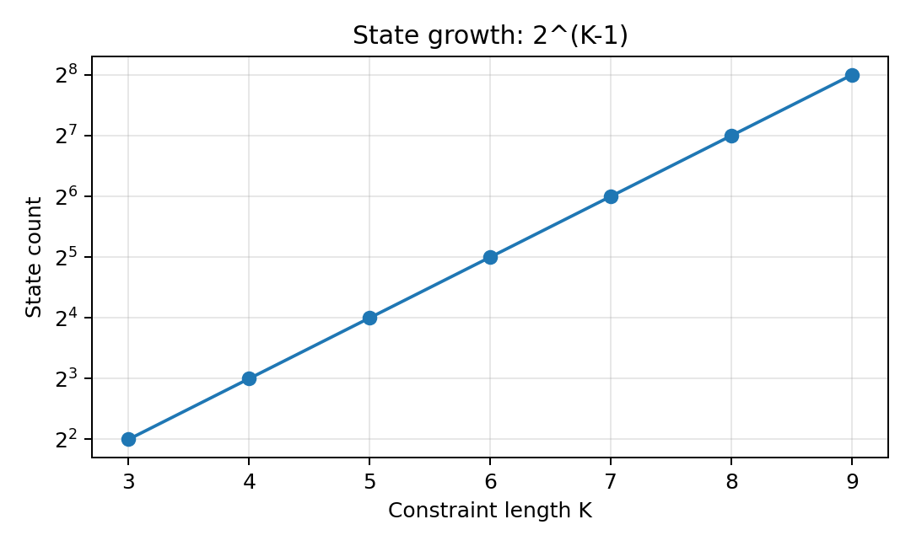

图 1：状态数随 K 指数增长。这张图说明 constraint length 增大时，trellis 状态数会按指数增长。K=7 对应 64 个状态，这意味着后续 BMU、ACS、survivor memory 和 traceback 都要围绕 64-state trellis 展开，硬件规模、资源占用和时序压力都明显高于 4-state 小例

`[171,133]` 是卷积编码器的两条生成多项式，用八进制表示。由于本项目使用 K=7，编码器每次输出时会参考当前输入 bit 和前 6 个历史 bit，共 7 个 bit。八进制 171 转成二进制是 1111001，表示第一路输出选择对应位置为 1 的寄存器 bit 进行 XOR；八进制 133 转成二进制是 1011011，表示第二路输出选择另一组寄存器 bit 进行 XOR。因此，每输入 1 个原始 bit，编码器会按照这两条 XOR 抽头规则分别生成两个 encoded bits，这也是 rate-1/2 的来源

本项目同时保留 hard-decision baseline 和 soft-decision hero design。baseline 是 hard-decision 版本，输入只包含 0 或 1，主要用于验证 trellis 构造、state numbering 和基本 ACS 流程是否正确。hero design 是最终重点验证的 3-bit soft-decision 版本，输入用 0 到 7 表示接收符号的置信度，可以比 hard-decision 保留更多信道信息。

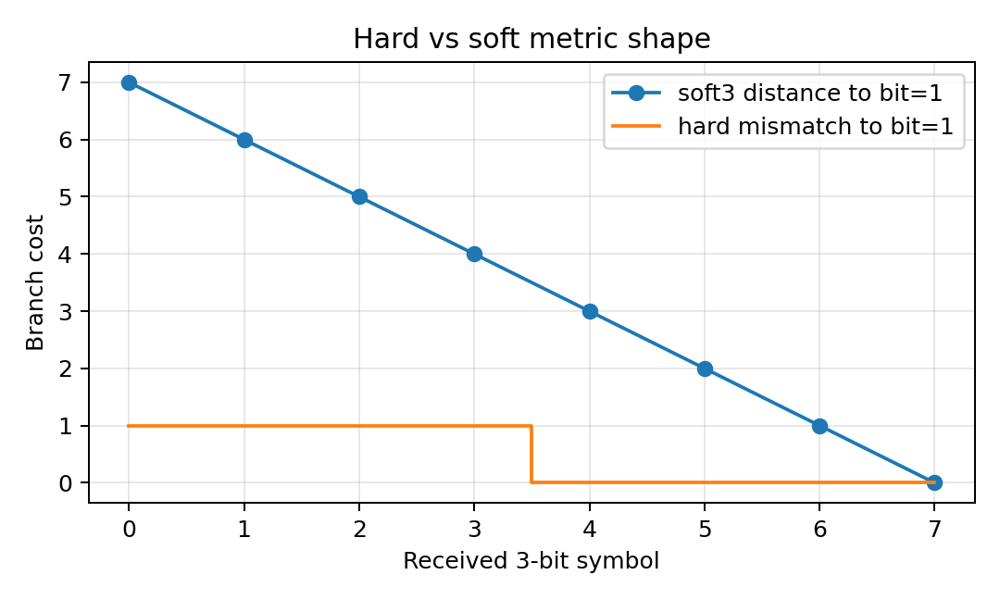

图 2：硬判决和软判决分支成本形状。Hard-decision 会先把接收信号直接判成 0 或 1，因此分支成本只反映“是否相同”这种粗粒度判断；例如收到 1 时，只知道它被判成了 1，却不知道这个 1 是非常可靠，还是接近判决边界。Soft-decision 则保留接收值与理想 0 或理想 1 之间的距离，本项目用 3-bit soft symbol 表示 0 到 7 的置信度刻度，因此译码器在比较候选路径时可以利用更细的可靠性信息。这样一来，即使两个候选路径在 hard-decision 下看起来差不多，soft-decision 也可能根据接收值的距离差异选出更合理的路径。

hero design 的核心参数， traceback depth 设为 40，path metric width 设为 12 bit，并使用 subtract-min normalization 控制 path metric 的数值范围。这些参数是通过参数扫描确定的。通过分别改变关键设计参数，观察不同配置下的 mismatch 数量和硬件代价，从而选择一个在正确性、资源和延迟之间更平衡的配置。

* traceback depth：回溯深度，也就是 traceback 时向前追踪多少步再确定输出 bit。depth 太小，路径可能还没有充分收敛，容易选错；depth 太大，译码通常更稳定，但会增加 survivor memory 需求和等待时间。
* path metric width：路径度量位宽，也就是硬件中用多少 bit 保存累计路径代价。位宽太小，path metric 可能溢出或截断，导致路径比较错误；位宽太大，则会增加 64 个状态对应的寄存器资源和时序压力。
* normalization：归一化方法，用来控制 path metric 不断累加导致数值越来越大的问题。本项目使用 subtract-min normalization，也就是每一步把所有 path metric 同时减去当前最小值。这样不会改变路径之间的相对大小，但可以降低数值范围，减少溢出风险。

项目分别尝试了不同 traceback depth、不同 path metric width 和不同 normalization 方案，并用同一批测试向量统计 mismatch 数量。结果显示，在当前测试向量下，traceback depth 为 40、path metric width 为 12 bit、使用 subtract-min normalization 时可以实现 0 mismatch，同时不会像更大 depth 或更大位宽那样继续增加不必要的存储、延迟和资源压力。因此，这组配置被选为最终的 hero design。


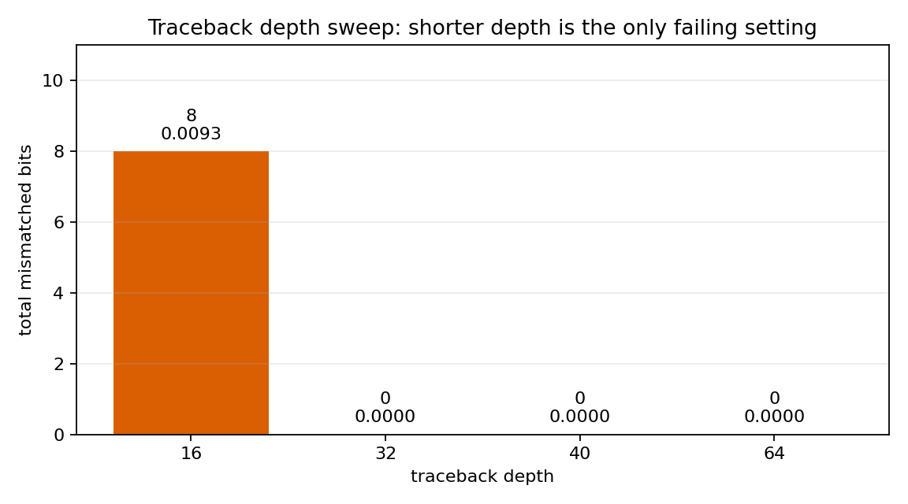

图 3 展示了 traceback depth 对 mismatch 数量的影响。depth=16 时，当前向量集中出现 8 个 mismatch，说明回溯深度太短时，路径还没有充分收敛，译码器可能过早做出判断。depth=32、40、64 时，当前测试向量下 mismatch 都为 0。因此，depth=40 的意义是：它已经达到当前测试条件下的 0 mismatch，同时相比 depth=64 可以减少一部分 survivor memory 需求和 traceback 等待时间。


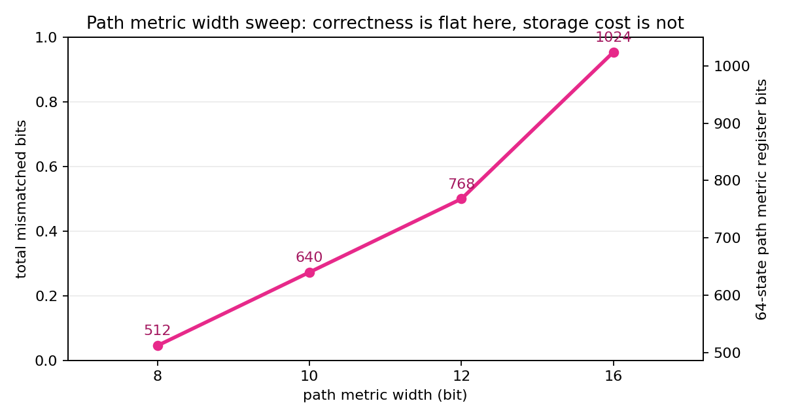

图 4 展示了 path metric width 对硬件代价的影响。在 depth=40 和 subtract-min normalization 条件下，当前测试集里 8/10/12/16 bit 都没有观察到 mismatch，所以图中直接在每根柱子底部标出 mismatch=0；柱高表示 64 个状态需要保存的 path metric register 总位数。位宽越大，寄存器位数从 512 增加到 1024，加法器和比较器也会变宽，资源占用和时序压力都会上升。因此，选择 12 bit 不是因为 16 bit 不正确，而是因为 12 bit 已经足够通过当前功能闭环，同时比 16 bit 更克制。


| 项目项               | 取值                                           | 数据来源                                                                  | 为什么这样选                                                                    |
| ----------------- | -------------------------------------------- | --------------------------------------------------------------------- | ------------------------------------------------------------------------- |
| 编码配置              | Convolutional Code, rate-1/2, K=7, [171,133] | `spec/viterbi_spec.json`                                              | rate-1/2 提供冗余用于纠错；K=7 产生 64 个状态，能体现 Viterbi 硬件结构压力；[171,133] 是经典生成多项式配置。  |
| baseline 设计       | Hard-Decision Viterbi Decoder                | `spec/viterbi_spec.json`                                              | 输入只有 0/1，结构更简单，适合作为基础版本来检查 trellis、state numbering、BMU 和 ACS 是否正确。        |
| hero 设计           | 3-bit Soft-Decision Viterbi Decoder          | `spec/viterbi_spec.json`                                              | soft-decision 保留接收置信度，比 hard-decision 更适合带噪声输入，是本项目最终重点优化和上板验证的版本。        |
| soft symbol 位宽    | 3 bit，取值范围 0 到 7                             | `spec/viterbi_spec.json`                                              | 用有限位宽表达接收符号更接近 0 还是 1，在信息量和硬件资源之间折中。                                      |
| traceback depth   | 40                                           | `spec/viterbi_spec.json`; `data/analysis/traceback_depth_sweep.csv`   | depth 太短容易导致路径尚未收敛；depth 40 在当前 sweep 向量中达到 0 mismatch，同时比 depth 64 延迟更低。 |
| path metric width | 12 bit                                       | `spec/viterbi_spec.json`; `data/analysis/path_metric_width_sweep.csv` | path metric 需要足够宽以避免累计代价溢出；12 bit 在当前测试中保持 0 mismatch，并避免过度增加资源。          |
| normalization     | Subtract-Min Normalization                   | `spec/viterbi_spec.json`                                              | 每一步把所有 path metric 减去当前最小值，保留路径相对大小，同时控制数值增长。                             |
| payload 长度        | 96 bit                                       | `vectors/*/metadata.json`                                             | 能覆盖完整一帧测试，同时保持 RTL 仿真和板级 regression 的运行时间较短，方便快速迭代。                       |
| 目标开发板             | MZU04A-4EV / XCZU4EV                         | `spec/viterbi_spec.json`; `config/local.env`                          | 与实际可用的 ZU4EV 开发板和 Xilinx 2024.1 工具链一致，保证最终可以进行真实板级验证。                     |


## 4. 仓库结构与事实源

本仓库的组织原则是代码、数据、报告不要混在一起。
算法模型放在模型目录，硬件实现放在 RTL 目录，真实实验结果放在 data 目录，报告只引用这些已经落盘的结果。这样做的好处是，报告中每个数字都可以回到对应文件里检查，而不是只靠文字描述。

仓库首层结构如下：

```text
src/
|-- README.md                  项目入口说明，用来快速了解如何运行和验证。
|-- Report.md                  本报告的 Markdown 源文件。
|-- Report.pdf                 由 Report.md 渲染出的提交版 PDF。
|-- spec/                      设计参数事实源，K、码率、多项式和默认 hero 参数都在这里。
|-- config/                    本机工具链、串口、板卡和 GitHub 地址配置。
|-- model/                     Python encoder、channel model 和 golden decoder。
|-- vectors/                   统一测试向量，每个 case 都有输入、输出和 metadata。
|-- rtl/                       Viterbi 译码器核心和板级 wrapper 的 RTL 实现。
|-- tb/                        xsim testbench，用来把 RTL 输出和 golden output 对齐比较。
|-- vivado/                    Vivado 综合、实现和 ZU4EV block design 构建脚本。
|-- vitis/                     ZU4EV bare-metal app，用于 DMA 传输和 UART 打印。
|-- scripts/                   自动生成、仿真、综合、上板和报告辅助脚本。
|-- data/                      所有模型、仿真、参数扫描、Vivado 和板级运行结果。
|-- docs/                      报告中使用的图、流程图和板级图片。
|-- reports/                   最终检查、PDF 预览和阶段性 review 文件。
|-- WORKLOG.md                 每个阶段实际执行了什么命令、遇到什么问题、结果如何。
|-- DECISIONS.md               关键工程取舍记录，例如为什么用 OCM buffer。
`-- EXPERIMENTS.yaml           实验索引，用 run_id 把命令、结果和数据文件关联起来。
```

这里最重要的是 `spec/` 和 `data/`
* `spec/viterbi_spec.json` 是设计参数事实源
* `data/model/` 记录 Python 测试
* `data/regression/` 记录 RTL 仿真；
* `data/analysis/` 记录参数扫描和 BER 近似分析；
* `data/impl/` 记录 Vivado 资源、时序和功耗估计；
* `data/board_runs/` 记录真实 UART 日志

## 5. 端到端工程流程

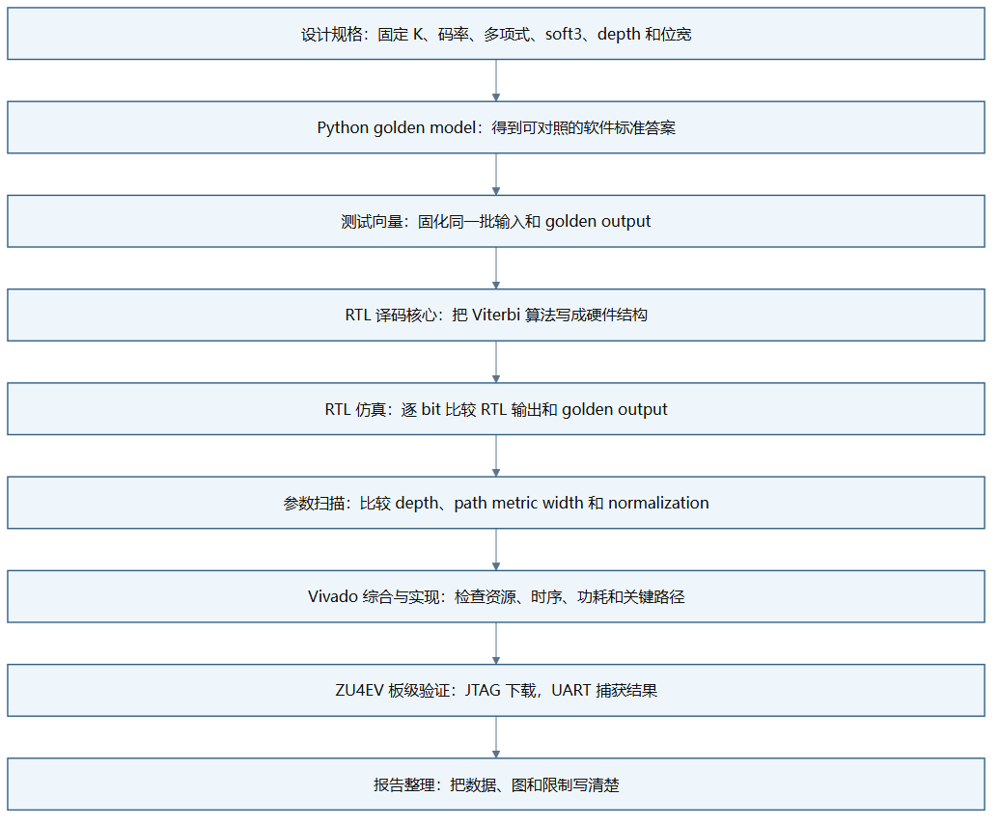

图 5：端到端工程闭环。这张图强调的是每一步产生什么、下一步为什么需要它。设计规格先固定参数，Python model 先建立标准答案，测试向量把输入输出固定下来，RTL 仿真证明硬件逻辑和软件答案一致，参数扫描解释为什么选择当前 hero 参数，Vivado 告诉我们资源和时序压力，板级验证最后证明数据真的能经过 PS、DMA、PL 和 UART 跑通。

这里每一步的作用如下

* 设计规格：回答“我们到底要做哪一种 Viterbi Decoder”。如果没有统一规格，Python、RTL 和 board app 很容易各用一套 K、tail termination 或 soft symbol 格式，最后即使结果不一致也很难定位。
* Python golden model：作用不是追求速度，而是追求清楚和可信。所有后续的 RTL output、board output 都要和它对齐比较。
* 测试向量：像一套统一试卷，同一道题发给 Python、RTL 仿真和真实开发板。这样调试时不用猜输入是否相同。
* RTL core：把 BMU、ACS、path metric、survivor memory 和 traceback 都写成硬件结构。
* 仿真：不只看 waveform，而是把 decoded bits 和 golden output 逐 bit 比较。只有 bit-true comparison 通过，才说明功能真的对齐。
* 参数扫描：比较 traceback depth、path metric width 和 normalization 的影响，用 mismatch 数量确认 hero 选型，而不是凭感觉选参数。
* Vivado 综合与实现：回答“功能正确的设计能不能放进 FPGA，并且能不能按目标时钟跑”。本项目在这里发现 soft-decision 版本没有达到 100 MHz timing closure。
* 板级验证：把设计放到真实 ZU4EV 板上，通过 JTAG 下载 bitstream 和 ELF，通过 UART 抓取运行日志。它验证的是整个 PS/PL/DMA 数据路径，不只是 decoder core。

## 6. 分支度量、软判决与定点路径度量

前面说 Viterbi 是找最像的路径，那么这里的 branch metric 就是像不像的打分方式。

先看 hard-decision。因为本项目是 rate-1/2，所以编码器每输入 1 个 payload bit，就会输出 2 个 encoded bits。也就是说，trellis 上每走一步，接收端都会拿到一组 2-bit 的 received bits。硬判决时，每个 received bit 只有 0 或 1，所以一条分支的距离只能是 0、1、2 三种。

例如某条候选分支理论上应该输出 `10`。如果接收端也收到 `10`，两个 bit 都相同，branch metric 就是 0。这个意思是这一步完全匹配。

```text
expected = 10
received = 10
distance = 0
```

如果接收端收到 `00`，第一位不同，第二位相同，branch metric 就是 1。这个意思是这一步有 1 个 bit 对不上，但还不是完全不像。

```text
expected = 10
received = 00
distance = 1
```

如果接收端收到 `01`，两个 bit 都不同，branch metric 就是 2。这个意思是这一步和这条候选分支最不像。

```text
expected = 10
received = 01
distance = 2
```

所以 hard-decision 每一步正好有两个 encoded bits。0 表示两个都对，1 表示错一个，2 表示两个都错。这也是为什么 hard-decision 信息比较粗，它只知道错了几个 bit，不知道每个 bit 错得有多可疑。

soft-decision 的区别在于，接收端不是只给 0 或 1，而是给一个 3-bit 数值，也就是 0 到 7。这里可以把 0 理解成非常像 0，把 7 理解成非常像 1，中间的 3 或 4 则表示“不太确定”。因此 soft-decision 可以表达置信度。

本项目的 soft3 branch metric 这样算，如果候选分支期望某个 encoded bit 是 0，就把理想值看成 0；如果期望是 1，就把理想值看成 7。然后用收到的 soft symbol 和理想值做绝对差。因为 rate-1/2 每一步有两个 encoded bits，所以两个差值相加就是这一条 branch 的成本。

例如某条候选分支期望输出 `10`，也就是第一位理想上应该像 1，第二位理想上应该像 0。如果接收的 soft3 值是 `(6,2)`，那么成本是：

```text
expected bits = 1 0
ideal soft   = 7 0
received     = 6 2
distance     = |6-7| + |2-0| = 1 + 2 = 3
```

这个 3 的意义是，第一位很像 1，只差 1；第二位有点偏离 0，差 2；两者合起来这条分支的局部代价是 3。另一条候选分支如果期望输出 `00`，理想值就是 `(0,0)`，同样接收 `(6,2)` 时成本会变成：

```text
expected bits = 0 0
ideal soft   = 0 0
received     = 6 2
distance     = |6-0| + |2-0| = 6 + 2 = 8
```

因此，接收 `(6,2)` 时，`10` 这条分支比 `00` 更合理。soft-decision 的优势就在这里，它不是只看 6 最后会被硬判成 1，而是知道它“很像 1”；也不是只看 2 最后会被硬判成 0，而是知道它离 0 还有一点距离。

Path metric 是把每一步 branch metric 沿着同一条候选路径累加起来。Branch metric 只描述某一步状态转移和当前接收符号之间的差距，而 path metric 描述的是从起点走到当前状态为止，整条路径和接收序列之间的累计差距。Viterbi Decoder 每走一步，都会把新的 branch metric 加到已有 path metric 上，再比较不同候选路径的总代价。总代价越小，说明这条路径整体上越符合接收数据，也就越可能是真实发送路径

但是在硬件实现中，path metric 不能无限增长。软件里可以用较大的整数类型暂时保存累计值，而 FPGA 里的寄存器位宽必须提前固定。例如 path metric width 如果设为 12 bit，那么它最多只能表示有限范围内的数值。一帧越长，branch metric 累加次数越多，path metric 就越可能变大。如果不加控制，数值可能超过固定 bit width 能表示的范围，造成溢出或截断。一旦 path metric 溢出，路径之间的大小关系就可能被破坏，ACS 可能会选择错误的 survivor path。

为了解决这个问题，本项目使用 subtract-min normalization。它的思想是：Viterbi Decoder 真正在意的不是每条路径的绝对代价是多少，而是哪条路径比另一条路径更小。换句话说，路径选择只依赖相对大小，而不是绝对数值。例如三条路径的 path metric 是：

```
Path A = 105
Path B = 112
Path C = 130
```

最优路径是 Path A。如果所有路径同时减去当前最小值 105，就得到：
```
Path A = 0
Path B = 7
Path C = 25
```

可以看到，数值整体变小了，但三条路径的相对顺序没有变化。Path A 仍然最小，Path B 仍然第二，Path C 仍然最大。因此，subtract-min normalization 不会改变 Viterbi 的路径选择结果，却能把 path metric 压回较小范围内，降低固定宽度寄存器溢出的风险。

具体到硬件流程中，subtract-min normalization 通常发生在每个 trellis step 的 ACS 更新之后。译码器先为所有状态计算新的 path metric，然后找出这些 path metric 中的最小值，再让所有状态的 path metric 同时减去这个最小值。这样做的结果是，每一步之后至少有一个状态的 path metric 被归一化为 0，其他状态保存的是相对这个最优状态多出来的代价。由于所有状态减去的是同一个数，所以不会影响后续 ACS 比较谁更小，只是把数值范围控制得更适合硬件实现。

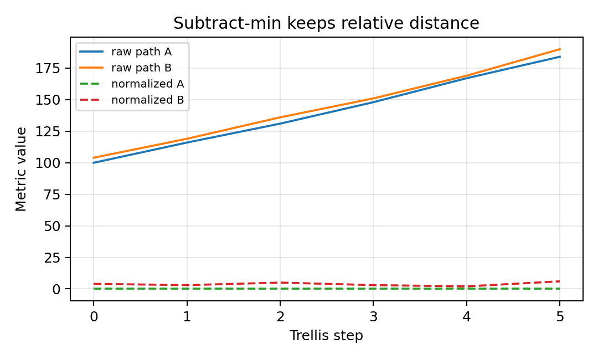

图 6 展示了 subtract-min normalization 的作用。图中每条路径的绝对 path metric 数值都被整体压低，但路径之间的相对大小没有改变。也就是说，归一化前哪条路径最优，归一化后仍然是哪条路径最优。它解决的是固定宽度硬件中的数值范围和溢出风险问题，而不是改变 Viterbi Decoder 的路径选择逻辑

## 7. RTL 架构

RTL 架构可以分成两个层次：
* decoder kernel：Viterbi 译码核心，只负责译码算法本身，回答译码结果怎么算出来,更关注算法硬件化，例如 branch metric 怎么算、64 个状态怎么更新、survivor decision 怎么保存、traceback 怎么恢复 bit
* board shell：为了真实上板运行而加在核心外面的接口和控制逻辑，包括 AXI Stream、AXI-Lite、DMA、PS/PL 连接和调试寄存器，回答数据怎么送进硬件、结果怎么从板子取回来，例如 ARM 端程序如何把输入数据送到 PL，DMA 如何搬运数据，控制寄存器如何启动译码器，UART 如何打印最终验证结果

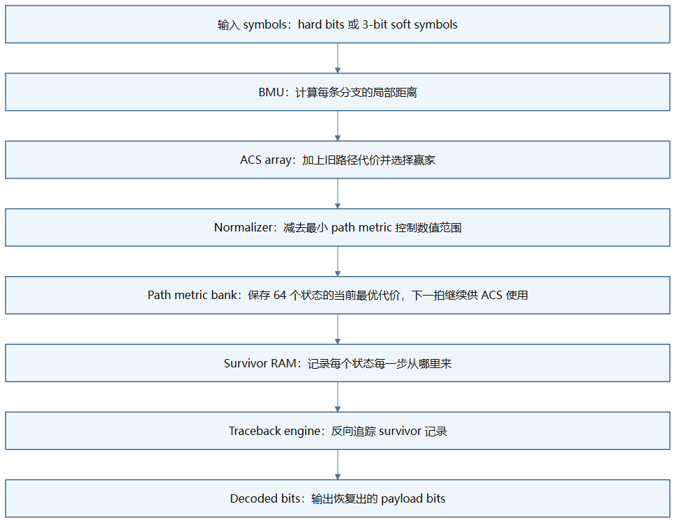

图 7 展示了 RTL 译码核心内部的数据流。接收符号先进入 BMU，BMU 计算每条 trellis 分支和接收数据之间的差距；随后 ACS array 使用这些 branch metric 更新每个状态的最优 path metric，并选择每个状态当前最合理的前驱路径；survivor RAM 记录这些选择结果；最后 traceback engine 根据 survivor RAM 中保存的记录反向追踪路径，并输出 decoded bits。换句话说，这张图对应的是 Viterbi Decoder 从“接收符号”到“恢复原始 bit”的硬件流水

其中的核心模块

`bmu_hard.sv` 是 hard-decision branch metric unit。它接收 2-bit 的 hard received bits，并和每条候选分支的 expected bits 比较，输出 0、1、2 三种距离。

`bmu_soft3.sv` 是 soft-decision branch metric unit。它接收两个 3-bit soft symbols，把 expected 0 映射到 0、expected 1 映射到 7，再计算两个绝对差之和。

`acs_unit.sv` 是单个 Add-Compare-Select 单元。它负责两条候选路径之间的选择：先把旧 path metric 加上 branch metric，再比较谁更小，最后输出赢家和 survivor bit。

`acs_array.sv` 是 64-state ACS 阵列。因为 K=7 产生 64 个状态，所以每一个 trellis step 都要更新 64 个状态的最优路径。

`path_metric_bank.sv` 保存所有状态当前的 path metric。可以把它理解成 64 个状态各自的“当前最优成本账本”。

`path_metric_normalizer.sv` 做 subtract-min normalization。它从 64 个 path metric 里找出最小值，然后把所有 path metric 同时减去这个最小值，避免固定宽度数值溢出。

`survivor_ram.sv` 保存每个时间步、每个状态的 survivor decision。它不是保存完整路径，而是保存“这个状态当时从哪个前驱来的”，后面 traceback 会用这些记录倒着找路。

`traceback_engine.sv` 负责从 survivor RAM 反向追踪路径。它的输出不是 branch metric，而是最终恢复出来的 decoded bits。

`viterbi_decoder_core_soft3.sv` 是 soft-decision hero core 的顶层。它把 BMU、ACS、normalization、survivor RAM 和 traceback 串起来，形成完整译码器。

板级相关 RTL 也需要说明

`viterbi_axis_wrapper.sv` 把 core 包成 AXI Stream 输入输出形式，让 DMA 可以直接送入 soft3 symbols 并取回 decoded bits

`viterbi_control_regs.v` 提供 AXI-Lite 控制寄存器，包括输入长度、状态、周期计数、seen/emitted 计数等调试信息

`viterbi_zu4ev_shell.v` 则把译码核心接入 ZU4EV 的 PS/PL 系统。

## 8. 验证方法

验证原则很简单，必须让输出 bits 和 golden output 逐 bit 对齐。Waveform 只用于定位错误，例如看 TLAST、valid、ready 或 survivor 写入是否异常；最终 PASS/FAIL 必须来自 bit-true comparison。

* Python model：先用 K=3 小规模 trellis 做 smoke test，因为 K=3 只有 4 个状态，出错时更容易定位；然后再切到 K=7 正式配置。Python 单元测试一共 6 个，覆盖无噪声、soft3 无噪声、tail termination、单 bit 错误纠正，以及有限位宽加 subtract-min normalization。结果是 6 个全部通过。
* 测试向量：把 no_noise、all_zero、impulse_one、single_bit_error、burst_error_short、random_hard、soft_awgn_0db、soft_awgn_1db、soft_awgn_2db 都固定成文件。每个 case 都有 metadata、输入、接收符号和 golden output。这样 RTL 和 board 不需要重新随机生成输入，避免“软件测的是一题，硬件跑的是另一题”。
* hard-decision RTL：hard baseline 先跑 no_noise、all_zero、impulse_one，再跑 single_bit_error。这个阶段主要确认 trellis 状态编号、branch metric、ACS 和 traceback 没有基础错误。结果文件是 `data/regression/rtl_regression_summary.csv`，4 个 case 全部 0 mismatch。
* soft-decision RTL：soft3 hero 继续跑 soft_awgn_0db、soft_awgn_1db、soft_awgn_2db。这个阶段重点检查 soft symbol packing、soft branch metric、有限 path metric width 和 subtract-min normalization。结果文件是 `data/regression/soft3_regression_summary.csv`，3 个 case 全部 0 mismatch。
* 参数扫描：不改变测试向量，只改变 traceback depth、path metric width 和 normalization。它回答的是“最终参数为什么这样选”。扫描结果已经在设计规格部分用图 3 和图 4 展示。
* Vivado：不再检查 decoded bits，而是检查 RTL 能否综合、布局布线，以及资源、时序、功耗估计如何。它暴露出当前 soft-decision hero 在 100 MHz 下时序失败。
* 真实 ZU4EV board：检查的不只是 core，还包括 PS、DMA、OCM buffer、AXI Stream packing、TLAST、cache flush/invalidate 和 UART log。最新通过的 UART 运行显示 3 个 case 全部 PASS。

验证结果可以概括为：

| 验证层级 | 主要目的 | 结果 |
| --- | --- | --- |
| Python model | 建立 golden reference | 6 个单元测试全部通过 |
| 测试向量生成 | 固定统一输入和期望输出 | 9 个 case 全部生成 metadata 和 golden output |
| hard-decision RTL | 检查基础 trellis、BMU、ACS、traceback | 4 个 case 全部 0 mismatch |
| soft-decision RTL | 检查 soft3、有限位宽和 normalization | 3 个 AWGN case 全部 0 mismatch |
| 参数扫描 | 确认 hero 参数选择 | depth=40、PM width=12、subtract-min 通过 |
| Vivado | 检查资源、时序和功耗估计 | 综合和实现完成，但 100 MHz 时序失败 |
| ZU4EV board | 检查真实 PS/PL/DMA/UART 数据路径 | 3 个 case 全部 0 mismatch |

## 9. 仿真与 BER 分析

这里需要先说明 BER。严格意义上的 BER 曲线需要很多随机 bit、很多 SNR 点，并且每个点要有足够大样本。当前项目的重点是端到端硬件闭环，每个 case 的 payload 是 96 bit，所以本报告不把有限向量结果包装成完整通信 BER 曲线。更准确的说法是 observed mismatch rate，也就是当前有限测试向量中的错 bit 比例。

仿真结果分三层看。

* no_noise：无噪声 case 的意义是检查基本功能。如果 no_noise 都失败，说明 trellis、state numbering、tail termination 或 traceback 存在基础错误，不能继续讨论 soft-decision 或 BER。
* 人工错误：single_bit_error 和 burst_error_short 这类 case 的意义是检查卷积码冗余是否真的被利用。如果译码器只是逐 bit 硬判，它无法利用整条路径信息；而 Viterbi 会从整条路径累计代价中选择更合理的输入序列。
* AWGN soft cases：soft_awgn_0db、soft_awgn_1db、soft_awgn_2db 用来检查 soft-decision 输入。0 dB 噪声更强，2 dB 相对更容易。参数扫描阶段发现，短 traceback depth=16 时，soft_awgn_0db 会出现 mismatch；当 depth 增加到 32、40、64 后，当前向量集下 mismatch 变成 0。

有限向量 BER 近似结果如下：

| 分析对象 | 数据来源 | 观察到的结果 | 说明 |
| --- | --- | --- | --- |
| hard-decision RTL 仿真 | `data/regression/rtl_regression_summary.csv` | 4 个 case 全部 0 mismatch | 基础 hard baseline 正确 |
| soft-decision RTL 仿真 | `data/regression/soft3_regression_summary.csv` | 3 个 AWGN case 全部 0 mismatch | soft3 hero 在选定参数下正确 |
| traceback depth 扫描 | `data/analysis/traceback_depth_sweep.csv` | depth=16 有 8 个 mismatch，32/40/64 为 0 | 回溯太短会损失路径收敛 |
| path metric width 扫描 | `data/analysis/path_metric_width_sweep.csv` | depth=40 下 8/10/12/16 bit 均为 0 mismatch | 当前向量集没有暴露位宽不足问题 |
| board UART 运行 | `data/board_runs/board_summary.csv` | 最终运行 3 个 case 全部 0 mismatch | 真实板级数据路径通过 |

需要特别强调的是，path metric width 的扫描结果看起来“全是 0”，不代表位宽永远不重要。它只说明在当前 96-bit payload、当前噪声向量、当前 subtract-min normalization 条件下，没有观察到 mismatch。未来如果帧更长、噪声更强、或者 normalization 关闭，位宽不足就可能暴露出来。

## 10. 综合与实现结果

Vivado 结果要分开读。综合通过只说明 RTL 能被映射成 FPGA 资源；实现通过只说明 placement 和 routing 完成；timing 是否满足，还要看 WNS 和 TNS。这里不能只看 return code。

| 设计版本 | 阶段 | LUT | FF | BRAM | DSP | WNS(ns) | TNS(ns) | 估算功耗(W) |
| --- | --- | --- | --- | --- | --- | --- | --- | --- |
| hard-decision core | synthesis | 8116 | 15243 | 0 | 0 | 6.956 | 0.000 | 0.410 |
| soft-decision core | synthesis | 10570 | 17118 | 0 | 0 | -23.241 | -17607.301 | 0.469 |
| soft-decision core | implementation | 10647 | 17118 | 0 | 0 | -20.433 | -16272.939 | 0.487 |

表 1：Vivado 综合与实现结果。数据来源为 `data/impl/vivado_summary.csv`。hard-decision core 的 WNS 为正，说明它在 10 ns 时钟约束下还有裕量。soft-decision core 的 WNS 为负，说明它虽然能综合和布局布线，但在 100 MHz 目标下没有满足时序。

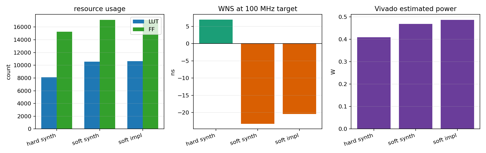

图 8：Vivado 资源、时序和功耗对比。左图比较 LUT 和 FF，中图比较 WNS，右图比较 Vivado 估算功耗。这样分开画以后可以看清楚：soft-decision 版本资源增加并不夸张，但 WNS 明显变差，真正的问题是关键路径太长。

hard-decision core 的结果说明基础架构可以被工具比较顺利地处理。它的 LUT 是 8116，FF 是 15243，WNS 为 6.956 ns，说明在 100 MHz 目标下有较大时序裕量。

soft-decision core 的综合结果显示 LUT 增加到 10570，FF 增加到 17118。这符合预期，因为 soft-decision 需要计算 3-bit soft symbol 到理想 0/7 的绝对距离，还需要更宽的 path metric 和 normalization 逻辑。

soft-decision core 的实现结果是本项目最重要的负结果。布局布线完成了，但 WNS 是 -20.433 ns，TNS 是 -16272.939 ns。也就是说，功能正确不等于高频可用。Vivado timing report 指向的关键路径从 `compute_idx_reg[4]/C` 到 `metrics_reg[47][10]/D`，data path delay 是 30.415 ns，其中 logic delay 是 13.839 ns，routing delay 是 16.576 ns，logic levels 有 116 层。这个结果说明一拍内完成 64-state soft ACS 更新和 subtract-min reduction 太重。

## 11. 时序、吞吐率、延迟与功耗分析

时序先看目标。100 MHz 的时钟周期是 10 ns。如果一条组合路径需要超过 10 ns 才能从源寄存器到达目标寄存器，那么下一拍采样时数据还没有稳定，设计就会 timing fail。hard-decision core 的 WNS 为正，所以满足 10 ns；soft-decision core 的 WNS 为负，所以不满足。

吞吐率要分清楚两种口径。理论上，如果 decoder core 能每个周期持续输出 1 bit，那么 100 MHz 下最高可以接近 100 Mbit/s。但本项目的板级测试记录的是整帧完成 cycles，包括启动、DMA、core 运行、等待和回读，不是纯 kernel steady-state 吞吐。因此报告只按 UART log 里的整帧 cycles 做实际估算。

板级最终运行记录如下：

| case | decoded bits | cycles | 25 MHz 下帧时间(us) | 25 MHz 下吞吐率(Mbit/s) | 按 100 MHz 同周期估算(Mbit/s) |
| --- | --- | --- | --- | --- | --- |
| no_noise | 96 | 802 | 32.08 | 2.99 | 11.97 |
| single_bit_error | 96 | 855 | 34.20 | 2.81 | 11.23 |
| soft_awgn_2db | 96 | 855 | 34.20 | 2.81 | 11.23 |

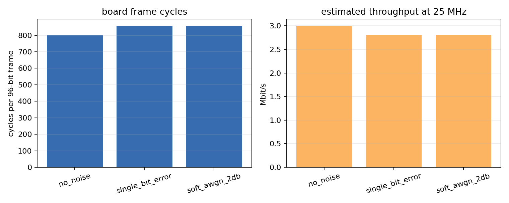

图 9：板级 cycles 和整帧吞吐率。左图显示每个 96-bit frame 的完成周期，右图把它换算成 25 MHz board shell 下的吞吐率。no_noise 少一些 cycles，两个带错误或带噪声 case 都是 855 cycles。

延迟也要谨慎解释。本次 UART log 记录的是整帧完成 cycles，不是 first-valid output cycle。因此不能伪造 first-valid latency。可以确定的是，最终 board run 中 `no_noise` 完整处理一帧用了 802 cycles，另外两个 case 用了 855 cycles。未来如果要精确 latency，需要在 RTL 或 control register 中额外记录 first output valid 的周期。

功耗同样要分清楚。Vivado 给出的 0.487 W 是 soft-decision implementation 在 100 MHz 条件下的 vector-less power estimate，也就是工具估算，不是板上电源仪器实测。板级实际运行在 25 MHz，不能直接把 0.487 W 当成真实板上功耗。

如果只做同条件估算，使用 0.487 W 和 100 MHz 同周期吞吐率，可以得到每 bit 能耗的大致量级：

| case | 100 MHz 同周期吞吐率(Mbit/s) | 使用 0.487 W 估算的能耗(nJ/bit) |
| --- | --- | --- |
| no_noise | 11.97 | 40.7 |
| single_bit_error | 11.23 | 43.4 |
| soft_awgn_2db | 11.23 | 43.4 |

这些数字的意义是给出量级参考，不是实测能耗结论。真正的功耗评估需要板级电源测量，或者至少需要带真实切换活动的 power analysis。

## 12. 板级系统设计与硬件测试

板级系统的作用是把 decoder core 接到真实 ZU4EV 开发板上。软件部分运行在 PS 的 ARM 上，硬件 decoder 运行在 PL 里，中间通过 AXI DMA 搬运数据。UART 用来把测试结果打印回电脑，JTAG 用来下载 bitstream 和 ELF。

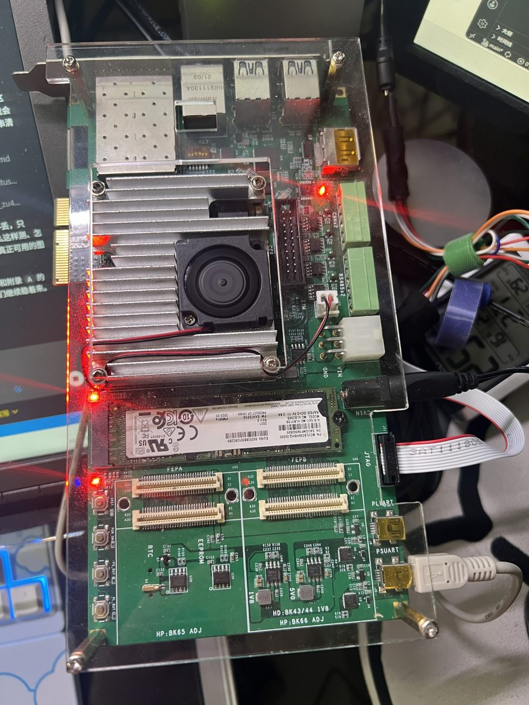

图 10：ZU4EV 开发板实物。这张图用于说明本项目不是只停留在仿真，而是接入了实际开发板。板级验证时，电脑通过 JTAG 下载硬件配置和裸机程序，通过 COM9 串口捕获 UART log。

板级数据流从上到下如下：

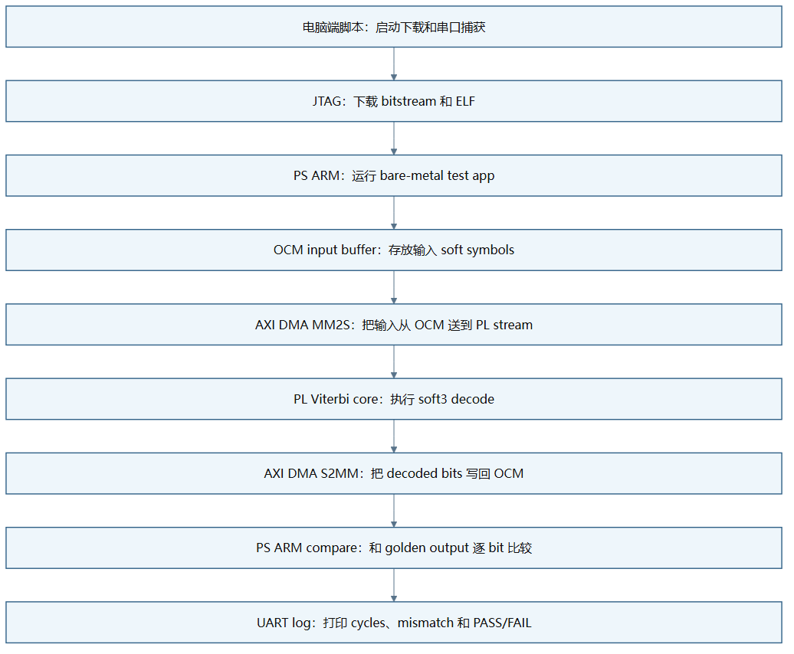

图 11：板级数据流。这张图说明一次 board validation 的完整路径：电脑启动测试，JTAG 下载，ARM 准备 OCM buffer，DMA 把输入送进 PL，Viterbi core 输出 decoded bits，DMA 写回 OCM，ARM 比对 golden output，最后 UART 打印结果。

这里有一个重要调试点：buffer 放在哪里。第一次尝试使用 DDR buffer，decoder 没有看到有效 stream input。后续改用 OCM buffer 后，core 能看到输入，但中间又出现 DMA decode error。最后定位到 Vivado address map 里 OCM segment 没有被 DMA 的 MM2S/S2MM 地址空间包含。补上 OCM segment 后，最终 run 通过。

CMD log 截图预留位置如下。正式提交如果需要截图，可以把运行 `python scripts\run_board_validation.py ...` 的终端截图放在这里；当前报告先保留文字证据，避免用伪造截图代替真实 log。

```text
[CMD LOG SCREENSHOT PLACEHOLDER]
Command:
python scripts\run_board_validation.py --skip-build --build-info <本机生成的 build_info.json> --port COM9 --baud 115200 --capture-timeout 180

Expected visible ending:
Completed 3 cases, failures=0
```

## 13. 板级验证结果

最终通过的 UART 运行编号是 `m7_board_20260502_083547`。对应 log 使用相对路径记录在：

```text
data/board_runs/m7_board_20260502_083547/uart.log
data/board_runs/m7_board_20260502_083547/uart_capture.json
```

最终成功 log 的关键几行如下：

```text
[no_noise] len=96 cycles=802 mismatches=0 status=0x00000001
[single_bit_error] len=96 cycles=855 mismatches=0 status=0x00000001
[soft_awgn_2db] len=96 cycles=855 mismatches=0 status=0x00000001
Completed 3 cases, failures=0
```

这几行说明三件事。第一，每个 case 都输出了 96 个 decoded bits，和 payload 长度一致。第二，mismatches 都是 0，说明 board 输出和 golden output 完全一致。第三，`status=0x00000001` 表示 shell 状态正常完成。

最终 case 结果如下：

| case | 输入 samples seen | 输出 samples emitted | decoded bits | cycles | mismatches | result |
| --- | --- | --- | --- | --- | --- | --- |
| no_noise | 204 | 96 | 96 | 802 | 0 | PASS |
| single_bit_error | 204 | 96 | 96 | 855 | 0 | PASS |
| soft_awgn_2db | 204 | 96 | 96 | 855 | 0 | PASS |

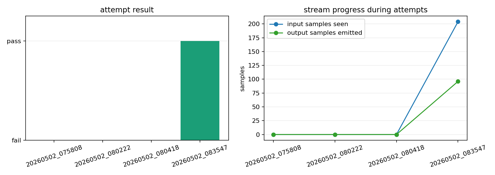

图 12：board validation attempts。这张图不是只看最终成功，而是把前几次失败也放出来。左边显示每次尝试是 pass 还是 fail；右边显示 stream 看到多少输入样本、吐出多少输出样本。可以看到中间失败时 core 只看到 109 个 sample 且没有输出，最终通过时看到完整 204 个输入 sample 并输出 96 个 decoded bits。

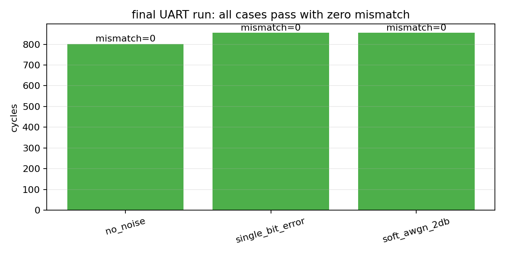

图 13：最终 UART case 结果。三个 case 全部 mismatch=0。cycles 数值也对应 UART log 中打印出的结果。

这张 attempts 图要这样理解。第一次 timeout 表示串口没有等到完成标志，说明系统没有完整跑完。第二次 functional failure 中，core 已经看到 109 个 samples，但 emitted 仍然是 0，这说明问题不是 app 完全没启动，而是 DMA/地址映射或 stream 传输中途出错。最后一次 pass 中，seen=204、emitted=96，说明输入完整进入 PL，输出也完整回到 PS。

## 14. 瓶颈分析与架构取舍

这个项目不是为了重新发明 Viterbi 算法。Viterbi Decoder 本身是经典算法，rate-1/2、K=7、[171,133] 也是经典配置。本项目的意义在于把这个算法真正放进 FPGA 工程闭环里，并且把每个工程取舍说清楚：为什么 soft-decision 更好，为什么 traceback depth 不能太短，为什么 path metric width 不能无限加，为什么功能正确后仍然会 timing fail，为什么 board shell 还会暴露 DMA 和地址映射问题。

第一个瓶颈是依赖关系。Viterbi 的 path metric 是逐步累加的，下一步必须依赖上一步的结果。这意味着它不像完全并行的组合计算那样可以随便拆开。每一步都要等上一拍的 path metric 更新完，才能继续下一拍。

第二个瓶颈是 64-state ACS 更新。K=7 带来 64 个状态，每个状态都要比较两条候选路径。hard-decision 时 branch metric 简单一些；soft-decision 时每条分支还要计算 soft distance，path metric 也更宽。当前设计把很多工作压在一个周期里，所以 Vivado 报告 116 logic levels 的关键路径。

第三个瓶颈是 subtract-min normalization。它虽然能控制 path metric 数值范围，但硬件上需要在 64 个状态里找最小值，再让所有 path metric 都减去这个最小值。这个 reduction tree 会加长组合路径。也就是说，normalization 帮助数值稳定，但增加时序压力。

第四个瓶颈是 survivor memory 和 traceback。traceback depth 越大，路径越稳定，但 survivor memory 越大，延迟也越长。参数扫描显示 depth=16 在当前 soft_awgn_0db 向量下出错，而 depth=32、40、64 通过，所以最终选择 depth=40 作为稳定性和延迟之间的折中。

第五个瓶颈是 board shell。仿真里只要 testbench 喂数据即可；板上还要处理 PS/PL 地址映射、DMA buffer、cache、TLAST、valid/ready 和 UART capture。最终 debug 说明，功能正确的 core 还必须配合正确的系统集成才能真正运行。

因此，这个工作的意义不在于证明“Viterbi 能译码”这种已知结论，而在于完成了一个可复现实验链条：从 Python 标准答案，到 RTL bit-true 仿真，到参数扫描，再到 Vivado 资源时序，再到 ZU4EV 真实 UART PASS。它也保留了负结果：soft-decision hero 当前没有达到 100 MHz，这比只展示成功截图更有工程价值。

## 15. 结论与未来工作

本项目已经完成可提交的端到端版本。算法上，Python model 建立了 golden reference；向量上，统一 case 让仿真和上板使用同一批输入输出；RTL 上，hard-decision baseline 和 soft-decision hero 都通过了 bit-true regression；参数上，traceback depth 和 path metric width 的选择有扫描依据；工具上，Vivado 综合和实现结果已经记录；板级上，ZU4EV 最新 UART run 显示 3 个 case 全部 0 mismatch。

当前最明确的结论是：功能闭环已经通过，但高频时序还没有完成。soft-decision hero 在 100 MHz 目标下 WNS 为 -20.433 ns，这说明当前一拍内完成的 64-state soft ACS、normalization 和 metric update 太重。板级验证在 25 MHz 下通过，说明设计逻辑和系统连接是正确的，但还不能说它已经是 100 MHz timing-clean implementation。

* Pipeline：最直接的方向是在 ACS array 和 subtract-min normalization 之间插入 pipeline stage，把原本一拍完成的加法、比较、最小值搜索和减法拆成多拍。这样会增加 latency，但有机会显著改善 WNS。
* Normalization 重组织：当前 subtract-min 每一步都做全局最小值搜索，时序压力较大。可以考虑分层 reduction、隔几步归一化一次，或者使用饱和策略做对比。不过这些都需要重新验证 fixed-point 行为，不能只改 RTL 不改 golden model。
* 真正的 BER campaign：当前报告只使用有限 96-bit vectors，不能声称得到完整 BER 曲线。后续可以为多个 SNR 点生成更长随机 payload，每个点累计足够多 bit，再画 BER vs SNR 曲线。这样才能评价 soft-decision 相对 hard-decision 的统计性能提升。
* DDR DMA：当前最终通过版本使用 OCM buffer，优点是地址路径简单、容量足够当前 case；缺点是容量有限。后续如果要跑更长帧或批量 BER，需要修通 DDR buffer，并严格处理 cache flush/invalidate 和地址映射。
* Survivor memory 优化：当前设计更偏向功能闭环和可调试性，后续可以把 survivor storage 更系统地映射到 BRAM 或更紧凑的 RAM 结构，减少 FF 压力，并让 traceback 更适合长帧。

总的来说，现在的版本足够作为课程 open-ended project 提交，因为它不是只停留在代码层面，而是把算法、RTL、参数扫描、Vivado 和真实开发板验证串起来了。报告中保留 timing failure 和 board debug 过程，是为了说明这个项目是工程闭环，而不是只挑好看的结果展示。

## 16. AI 工具声明

AI tools were used as engineering assistants for planning, code organization, script generation, debugging guidance, and report drafting. Final architectural decisions, validation criteria, experiment interpretation, and submission responsibility remain with the author.
